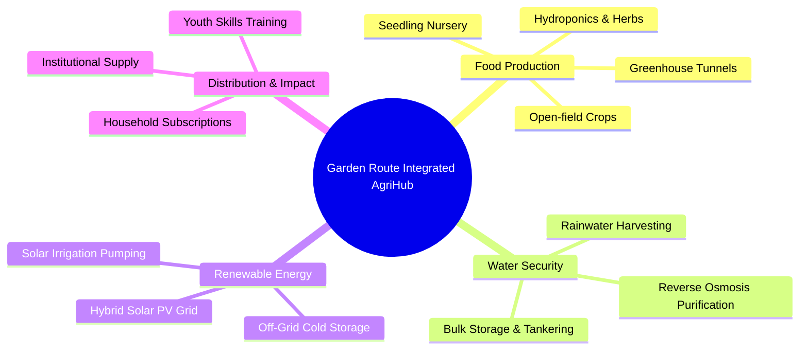
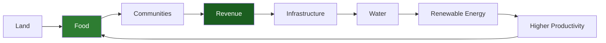
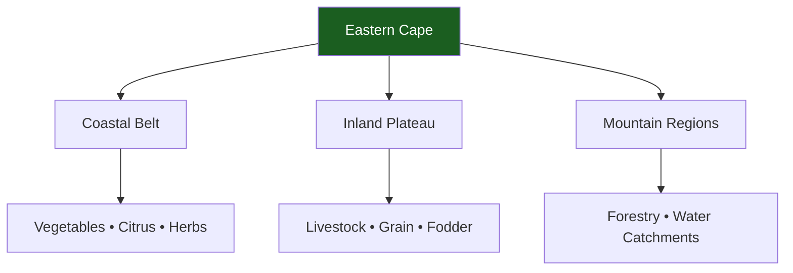

# 04 Market Research

> **NACIRFA DREAM GROUP (PTY) LTD**  
> **Eastern Cape Integrated AgriHub**  
>
> **Document ID:** NDG-MR-2026-V1.0
>
> **Classification:** Commercial in Confidence
>
> **Prepared For:**
>
> - Development Finance Institutions (DFIs)
> - African Enterprise Challenge Fund (AECF)
> - Industrial Development Corporation (IDC)
> - Development Bank of Southern Africa (DBSA)
> - Land Bank
> - Commercial Banking Partners
> - Impact Investors
> - Climate Finance Institutions
> - Strategic Agricultural Partners
>
> **Purpose**
>
> This report provides a comprehensive assessment of the commercial viability, macroeconomic environment, agricultural opportunity, customer demand, climate resilience, water security, and investment attractiveness of the proposed Eastern Cape Integrated AgriHub.
>
> It establishes the market case for developing a scalable climate-smart agricultural enterprise capable of improving food security, water resilience, renewable energy adoption, and rural economic development while generating sustainable commercial returns.

---

# Table of Contents

1. Executive Summary
2. Investment Thesis
3. South African Agricultural Overview
4. Eastern Cape Regional Overview
5. Climate & Environmental Conditions
6. Water Security Assessment
7. Soil & Land Suitability
8. Agricultural Production Opportunities
9. Target Markets
10. Customer Segmentation
11. Tourism & Hospitality Market
12. Institutional Procurement Opportunities
13. Competitor Analysis
14. Industry Trends
15. SWOT Analysis
16. PESTLE Analysis
17. Porter's Five Forces
18. Market Risks
19. Commercial Opportunity
20. Phased Expansion Strategy
21. Investment Readiness
22. References

---

# 1. Executive Summary

The Eastern Cape is emerging as one of South Africa's most strategically important regions for climate-smart agricultural investment.

The province possesses significant agricultural land, diverse climatic zones, relatively affordable rural land, expanding irrigation opportunities, and increasing public investment into food security, climate adaptation, and renewable energy infrastructure.

At the same time, communities throughout the province continue to experience:

- Food insecurity
- Water shortages
- High unemployment
- Youth migration
- Rising food prices
- Energy instability
- Climate-related agricultural risks

Rather than addressing these challenges individually, the **Eastern Cape Integrated AgriHub** proposes a commercially integrated ecosystem combining food production, water security, renewable energy, agricultural technology, and community development into a single scalable enterprise.

The project has been designed around four strategic pillars:

Unlike conventional farming operations, the AgriHub generates multiple recurring revenue streams while reducing dependence on unreliable municipal infrastructure through integrated resource management.

The model is intentionally modular, allowing phased expansion as commercial demand and funding capacity increase.

---

# 2. Investment Thesis

## Why the Eastern Cape?

The Eastern Cape presents a unique convergence of agricultural potential, climate diversity, natural resources, and socio-economic need.

The province contains extensive arable land, multiple agro-ecological zones, established livestock and horticultural industries, major logistics corridors, and access to domestic and export markets through the ports of Gqeberha (Port Elizabeth), Ngqura, and East London.

These advantages provide an ideal foundation for developing an integrated climate-smart agricultural hub capable of serving local communities while participating in national and international agricultural value chains.

Key investment drivers include:

- Large areas of agricultural land available for development
- Diverse climatic conditions supporting multiple crop types
- Existing commercial farming ecosystem
- Strong government focus on agricultural development
- Growing demand for sustainable food production
- Increasing climate finance availability
- Expanding renewable energy adoption
- Rising consumer preference for locally produced food

---

# 3. Strategic Vision

The Eastern Cape Integrated AgriHub is designed as a regenerative agricultural platform where each business unit strengthens the performance of the others.

Instead of relying on a single commodity, the business combines:

- Vegetable production
- Herb cultivation
- Seedling production
- Water purification
- Water distribution
- Renewable energy
- Agricultural consulting
- Skills development
- Nursery operations
- Future licensed industrial hemp cultivation and processing (subject to applicable laws and licensing)

This diversified structure improves resilience against market volatility while creating multiple income streams.

---

# 4. South African Agricultural Overview

Agriculture remains one of South Africa's most important productive sectors, contributing to food security, exports, employment, and rural development.

The country has developed globally competitive value chains across horticulture, grains, livestock, citrus, wine, forestry, and high-value niche crops.

Key strengths include:

- Advanced commercial farming expertise
- Modern logistics infrastructure
- International export capability
- Diverse climatic regions
- Strong agricultural research institutions
- Growing AgriTech sector

However, the sector also faces persistent structural challenges:

| Challenge | Commercial Impact |
|-----------|-------------------|
| Climate variability | Lower crop yields and increased production risk |
| Water scarcity | Reduced irrigation reliability |
| Electricity instability | Higher production costs and cold-chain disruption |
| Input cost inflation | Pressure on operating margins |
| Transport costs | Reduced competitiveness |
| Ageing municipal infrastructure | Increased need for private infrastructure investment |

These challenges create opportunities for integrated agricultural enterprises capable of reducing reliance on municipal services while increasing operational efficiency.

---

# 5. Eastern Cape Regional Overview

The Eastern Cape is South Africa's second-largest province by land area and contains some of the country's most diverse agricultural landscapes.

Major agricultural regions include:

- Sundays River Valley
- Kat River Valley
- Fish River Valley
- Amathole District
- Chris Hani District
- OR Tambo District
- Sarah Baartman District

The province supports production across multiple sectors:

- Citrus
- Vegetables
- Livestock
- Dairy
- Forestry
- Macadamias
- Avocados
- Herbs
- Medicinal plants

Its climatic diversity enables year-round agricultural activity across different regions.

---

# 6. Eastern Cape Climate & Environmental Conditions

One of the Eastern Cape's greatest competitive advantages is its climatic diversity.

The province spans several rainfall zones and agro-ecological regions, allowing different production systems to operate simultaneously.

## Climate Advantages

- Mediterranean conditions in western districts
- Temperate coastal climate along the Indian Ocean
- Summer rainfall regions inland
- High-altitude production zones
- Frost-free coastal production areas
- Significant solar irradiation suitable for photovoltaic energy

This diversity enables crop rotation, season extension, and risk diversification.

## Climate Risks

The project has been designed with climate resilience in mind.

Primary risks include:

- Periodic droughts
- Heat stress
- Variable rainfall
- Extreme weather events
- Water infrastructure constraints

Mitigation measures include:

- Greenhouse cultivation
- Rainwater harvesting
- Efficient drip irrigation
- Solar-powered pumping
- Bulk water storage
- Crop diversification
- Climate-smart farming practices
