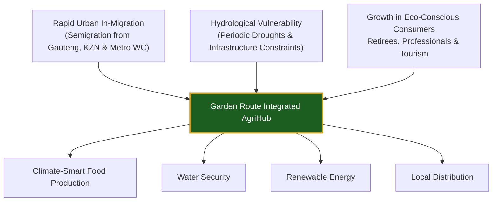
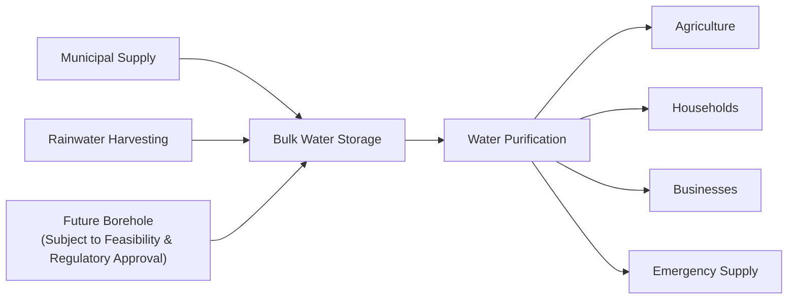
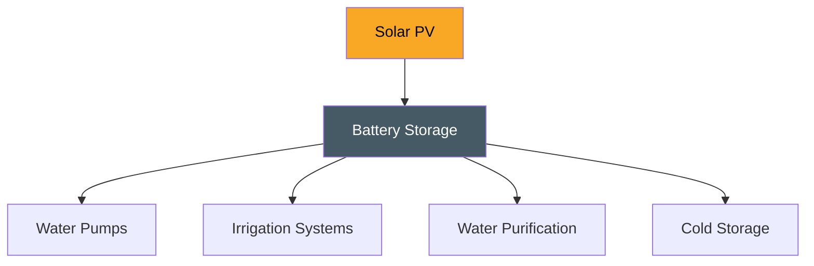

# 04 Market Research

> **Purpose**
>
> Industry analysis, customer segmentation, competitor benchmarking, climate risk assessment, and commercial demand validation for the Garden Route Integrated AgriHub.

---

# Executive Summary

The Garden Route District Municipality represents one of South Africa's fastest-growing regional economies, driven by semigration, premium tourism, sustainable residential development, and increasing demand for high-quality locally produced food.

Simultaneously, climate change, municipal water constraints, aging infrastructure, and rising energy costs are transforming how commercial agriculture operates. These structural challenges create significant opportunities for resilient, integrated agricultural enterprises capable of producing food while managing water and energy independently.

The Garden Route Integrated AgriHub has been designed specifically to operate within this evolving landscape by combining climate-smart agriculture, renewable energy, water purification, and localized distribution into a diversified commercial ecosystem.

---

# Macro Agricultural & Environmental Landscape

South Africa's agricultural sector continues to demonstrate strong underlying fundamentals, supported by robust domestic demand and record agricultural exports.

Despite this positive outlook, producers face increasing operational pressures resulting from:

- Climate variability and prolonged droughts
- Municipal water infrastructure failures
- Escalating electricity tariffs
- Rising fuel and logistics costs
- Supply chain disruptions
- Increasing production input costs

These conditions favour businesses capable of reducing dependence on municipal infrastructure while improving operational resilience through renewable energy, water independence, and diversified revenue streams.

---

# Garden Route Regional Dynamics

---

# Regional Demographic Analysis

The Garden Route District, including George, Mossel Bay, Knysna, and Plettenberg Bay, continues to experience sustained population growth through semigration.

The region attracts:

- Professionals relocating from metropolitan areas
- Retirees
- Remote workers
- Eco-conscious households
- Tourism-related businesses
- Lifestyle estate developments

Population growth increases demand for:

- Fresh vegetables
- Safe drinking water
- Local food systems
- Sustainable agriculture
- Reliable infrastructure
- Renewable energy

This demographic transition creates favourable conditions for locally integrated agricultural enterprises.

---

# Water Security Assessment

## Existing Challenges

Commercial agriculture increasingly faces:

- Municipal water interruptions
- Seasonal drought conditions
- Aging water infrastructure
- Population-driven demand growth
- Increasing water tariffs

Reliable water access has become one of the largest operational risks facing agricultural producers.

---

## Strategic Response

The AgriHub incorporates multiple layers of water resilience.

---

# Energy Resilience

Increasing electricity costs and grid instability continue to affect irrigation, pumping, refrigeration, and food preservation.

Solar integration provides:

- Reduced operating expenses
- Irrigation reliability
- Water purification resilience
- Cold storage continuity
- Lower carbon emissions

---

# Target Market Analysis

The Garden Route Integrated AgriHub serves multiple complementary customer segments, reducing dependence on any single revenue source.

| Customer Segment | Core Demand Driver | Value Proposition | Target Revenue |
|------------------|--------------------|-------------------|---------------:|
| Household Subscriptions | Healthy, locally grown vegetables and clean drinking water | Weekly vegetable subscriptions with bottled or bulk purified water delivery | 25% |
| Institutions & Hospitality | Hotels, restaurants, schools, hospitals and retirement estates require consistent supply | Premium greenhouse produce with verified water quality and reliable logistics | 35% |
| Retail & Distributors | Demand for premium local vegetables and seedlings | Reduced transport distances, fresher produce and improved shelf life | 20% |
| Bulk Water Services | Municipal interruptions, commercial projects and drought response | Bulk purified water delivery, refill stations and emergency supply | 15% |
| Consulting & Training | ESG commitments, youth employment and agricultural development | Climate-smart agriculture training, advisory services and incubation programmes | 5% |

---

# Customer Personas

## Household Family

### Needs

- Affordable fresh vegetables
- Reliable drinking water
- Convenient weekly delivery

### Pain Points

- Rising grocery costs
- Municipal water interruptions
- Fuel and transport expenses

---

## Hospitality Sector

### Needs

- Consistent premium produce
- Reliable delivery schedules
- Food safety compliance

### Pain Points

- Seasonal shortages
- Supply inconsistency
- Long transport distances

---

## Commercial Water Customer

### Needs

- Reliable emergency water
- Bulk water deliveries

### Pain Points

- Construction interruptions
- Municipal outages

---

# Competitive Positioning

| Competitor | Primary Strength | Limitation | AgriHub Advantage |
|------------|------------------|------------|-------------------|
| Traditional Farms | Agricultural experience | Limited diversification | Integrated food, water and energy ecosystem |
| Supermarkets | Distribution scale | Long supply chains | Fresh local produce with direct distribution |
| Water Suppliers | Existing customer base | Single-service business | Multiple complementary revenue streams |
| Hydroponic Producers | Technology adoption | High electricity dependence | Solar-powered resilient infrastructure |

---

# Market Differentiators

The Garden Route Integrated AgriHub differentiates itself through:

- Climate-smart agricultural production
- Renewable energy integration
- Water independence strategy
- Multiple recurring revenue streams
- Localized supply chains
- Community-focused distribution
- ESG-aligned operating model
- Regional scalability

---

# Market Risks

| Risk | Potential Impact | Mitigation Strategy |
|------|-----------------|--------------------|
| Climate variability | Lower crop yields | Greenhouses, climate-smart farming and crop diversification |
| Water shortages | Production disruption | Rainwater harvesting, purification and storage |
| Energy instability | Increased operating costs | Solar PV and battery backup |
| Rising fuel prices | Distribution costs | Local customer focus and optimized delivery routes |
| Competition | Margin pressure | Product quality, integration and customer relationships |

---

# Strategic Outlook

Several long-term trends support continued growth:

- Population expansion
- Urban semigration
- Sustainable food demand
- Renewable energy adoption
- ESG investment growth
- Climate adaptation funding
- Local food security initiatives

These trends position the Garden Route Integrated AgriHub to become a leading example of integrated climate-smart agriculture within Southern Africa.

---

# Strategic Conclusion

The Garden Route offers one of South Africa's most compelling environments for climate-smart agricultural investment.

Rather than competing solely as a commercial farm, the Garden Route Integrated AgriHub combines food production, water infrastructure, renewable energy and localized distribution into a resilient, diversified business ecosystem.

This integrated model reduces operational risk, improves long-term profitability, strengthens food and water security, and aligns with national and international priorities relating to climate resilience, sustainable agriculture and inclusive economic development.

---

# References

- Statistics South Africa (Stats SA)
- Department of Agriculture, Land Reform and Rural Development (DALRRD)
- Department of Water and Sanitation (DWS)
- Western Cape Government
- Garden Route District Municipality Integrated Development Plan (IDP)
- Food and Agriculture Organization (FAO)
- World Bank
- International Fund for Agricultural Development (IFAD)
- South African Weather Service (SAWS)
