# 05 Financial Model

> **NACIRFA DREAM GROUP (PTY) LTD**
>
> **Eastern Cape Integrated AgriHub**
>
> **Document ID:** NDG-FM-2026-V1.0
>
> **Classification:** Commercial in Confidence

---

# Table of Contents

1. Executive Financial Summary
2. Financial Philosophy
3. Business Units & Revenue Model
4. Revenue Streams
5. Operating Model
6. Phased Capital Strategy
7. Phase 1 Capital Budget
8. Phase 2 Capital Budget
9. Phase 3 Capital Budget
10. Startup Equipment Register
11. Procurement Schedule
12. Operating Expenses
13. Staffing Plan
14. Five-Year Financial Forecast
15. Cash Flow Forecast
16. Balance Sheet Forecast
17. EBITDA Analysis
18. Breakeven Analysis
19. Sensitivity Analysis
20. Funding Strategy
21. Funding Sources
22. Investor Returns
23. Financial Risks
24. Assumptions

# 1. Executive Financial Summary

The Eastern Cape Integrated AgriHub has been structured as a phased infrastructure investment designed to minimise capital risk while maximising long-term enterprise value.

Rather than constructing the full agricultural ecosystem at inception, infrastructure is deployed in modular phases that are activated only after operational and commercial milestones have been achieved.

This approach:

- Reduces initial capital requirements.
- Improves grant eligibility.
- Limits debt exposure.
- Allows proof of concept before major expansion.
- Supports positive operational cash flow earlier in the project lifecycle.
- Aligns with the funding methodologies commonly used by development finance institutions and blended finance programmes.

The business combines multiple complementary income streams to reduce reliance on any single market segment.

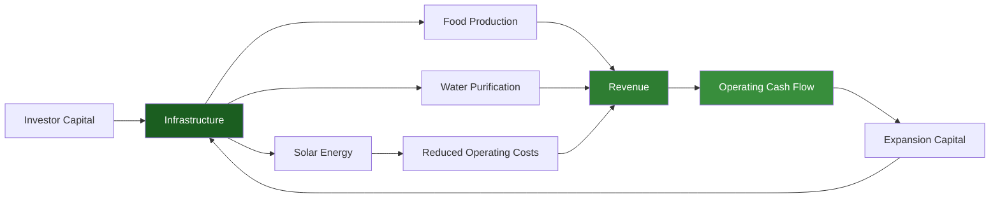

---

# 2. Financial Philosophy

The financial model is based on five core principles:

1. **Capital Efficiency** – Invest only in infrastructure required for the next stage of growth.
2. **Diversification** – Build multiple revenue streams to reduce earnings volatility.
3. **Resilience** – Reduce dependence on municipal water and grid electricity.
4. **Scalability** – Design assets that can be replicated in additional locations.
5. **Sustainability** – Balance profitability with measurable environmental and social outcomes.

---

# 3. Business Units & Revenue Model

Revenue is generated from several complementary business units.

| Business Unit | Revenue Type | Frequency |
|---------------|--------------|-----------|
| Vegetable Production | Produce sales | Daily / Weekly |
| Herbs & Specialty Crops | Produce sales | Weekly |
| Seedling Nursery | Seedling sales | Seasonal |
| Water Purification | Bulk and bottled water | Daily |
| Vegetable Subscription Boxes | Subscription | Monthly |
| Hospitality Supply | Contract sales | Weekly |
| Institutional Supply | Contract sales | Monthly |
| Agricultural Consulting | Service fees | Project-based |
| Training & Incubation | Course fees / grants | Quarterly |
| Future Hemp Operations* | Licensed products | Ongoing |

\*Subject to South African legislation and licensing requirements.

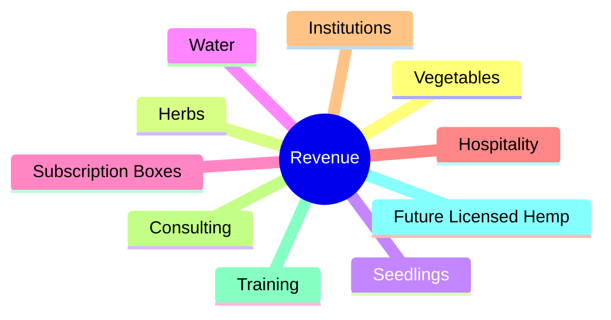

---

# 4. Phased Capital Strategy

Infrastructure investment is divided into three phases.


Each phase is funded only after key operational targets are achieved, reducing investor risk.

---

# 5. Phase 1 Capital Budget

**Objective:** Establish a commercially viable pilot operation with sufficient production capacity to validate demand, refine operating procedures, and generate recurring cash flow.

| Category | Purpose | Estimated Cost (ZAR) |
|-----------|---------|---------------------:|
| Land Preparation & Fencing | Site development and security | 450,000 |
| Greenhouse Tunnels (1,000 m²) | Protected cultivation | 1,100,000 |
| Water Infrastructure | Rainwater harvesting, storage, RO plant | 850,000 |
| Solar PV (5 kW) | Irrigation and water pumping | 350,000 |
| Cold Storage | Produce preservation | 300,000 |
| Delivery Vehicle | Distribution | 550,000 |
| Working Capital | Salaries, seed, compliance, operations | 1,250,000 |

**Total Phase 1 Capital Requirement:** **R4,850,000**

---

# 6. Startup Equipment Register

| Category | Equipment | Quantity | Phase | Status |
|-----------|-----------|---------:|------:|--------|
| Agriculture | Greenhouse Tunnels | 1,000 m² | 1 | Planned |
| Agriculture | Tractor (50–75 HP) | 1 | 2 | Planned |
| Agriculture | Brush Cutters | 4 | 1 | Planned |
| Agriculture | Rotavator | 1 | 1 | Planned |
| Agriculture | Seedling Trays | 500 | 1 | Planned |
| Water | Reverse Osmosis Plant | 10 kL/day | 1 | Planned |
| Water | Storage Tanks | 4 × 10 kL | 1 | Planned |
| Water | Booster Pumps | 2 | 1 | Planned |
| Solar | PV Array | 5–75 kW | 1–3 | Planned |
| Solar | Battery Storage | 1 Bank | 1 | Planned |
| Cold Chain | Walk-in Cold Room | 1 | 1 | Planned |
| Logistics | Bakkie | 1 | 1 | Planned |
| Logistics | Refrigerated Truck | 1 | 3 | Planned |
| Agritech | Weather Station | 1 | 2 | Planned |
| Agritech | Soil Moisture Sensors | Multiple | 2 | Planned |
| Agritech | Drone | 1 | 3 | Planned |
| Office | Computers | 5 | 1 | Planned |
| Security | CCTV System | 1 | 1 | Planned |
| Security | Electric Fence | 1 | 1 | Planned |

---
---

# 7. Phase 1 Capital Budget (Foundation & Proof of Concept)

## Strategic Objective

Phase 1 establishes the minimum viable commercial operation required to validate the AgriHub model. The focus is on proving technical feasibility, securing initial customers, generating recurring revenue, and demonstrating operational resilience through integrated food production, water purification, and renewable energy.

### Phase 1 Key Deliverables

- Secure and prepare agricultural land
- Install protected cultivation infrastructure
- Commission a 10,000 L/day Reverse Osmosis (RO) water purification plant
- Construct rainwater harvesting and bulk storage systems
- Install a 5 kW hybrid solar PV system for irrigation and water pumping
- Launch direct-to-consumer vegetable and purified water sales
- Develop the nursery and seedling operation
- Build operational procedures and governance systems

---

## Phase 1 Capital Allocation

| Category | Description | Estimated Cost (ZAR) | % of Phase Budget |
|-----------|-------------|---------------------:|------------------:|
| Land Preparation & Fencing | Clearing, levelling, fencing, access roads, soil improvement | 450,000 | 9.3% |
| Greenhouse Infrastructure | 1,000 m² multi-span tunnels with drip irrigation | 1,100,000 | 22.7% |
| Water Infrastructure | Rainwater harvesting, RO purification plant, storage tanks, pumps | 850,000 | 17.5% |
| Solar Energy System | 5 kW PV array, hybrid inverter, battery storage | 350,000 | 7.2% |
| Cold Storage & Pack Area | Walk-in cold room, packing benches, shelving | 300,000 | 6.2% |
| Logistics | Delivery bakkie, trailer, loading equipment | 550,000 | 11.3% |
| ICT & Administration | Computers, networking, accounting systems, office setup | 150,000 | 3.1% |
| Security | CCTV, alarm system, electric fencing, lighting | 150,000 | 3.1% |
| Working Capital Reserve | Salaries, seeds, packaging, utilities, compliance, contingency | 950,000 | 19.6% |

| **Total Phase 1 Investment** | | **R4,850,000** | **100%** |

---

## Phase 1 Infrastructure

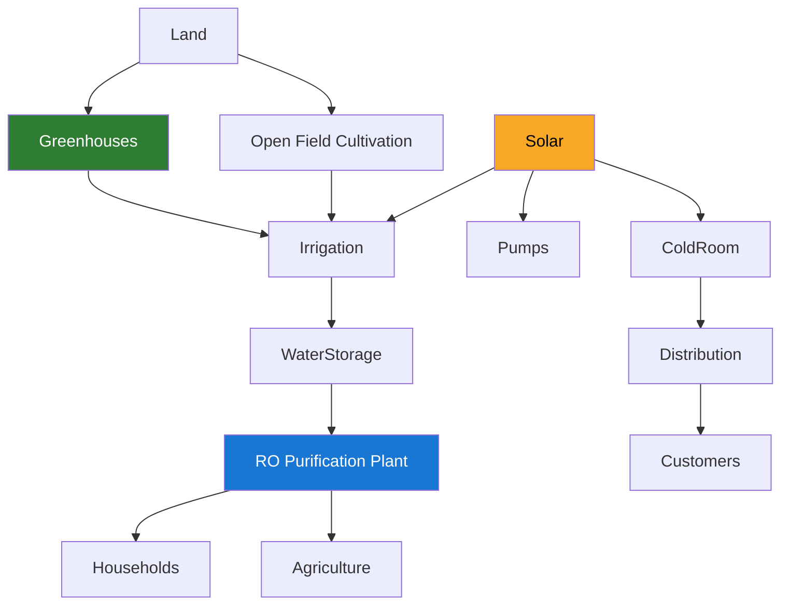

---

# Phase 1 Milestones

| Milestone | Target |
|------------|--------|
| Site secured | Month 1 |
| Infrastructure complete | Month 4 |
| Greenhouse operational | Month 5 |
| Water purification operational | Month 5 |
| First vegetable harvest | Month 6 |
| First commercial water sales | Month 6 |
| Monthly positive operating cash flow | Month 9 |

---

# 8. Phase 2 Capital Budget (Commercial Expansion)

## Strategic Objective

Phase 2 focuses on scaling proven operations into a commercially significant regional supplier capable of servicing households, hospitality businesses, schools, healthcare facilities, and retail distributors.

Revenue generated during Phase 1, together with additional blended finance, will support this expansion.

---

## Phase 2 Capital Allocation

| Category | Description | Estimated Cost (ZAR) |
|-----------|-------------|---------------------:|
| Greenhouse Expansion | Additional 2,000 m² protected cultivation | 1,400,000 |
| Water Infrastructure Upgrade | 25,000 L/day RO plant and 50 kL storage | 950,000 |
| Solar Expansion | Upgrade to 25 kW PV and lithium battery storage | 850,000 |
| Packhouse & Processing | Sorting, grading, packaging and cold-chain improvements | 800,000 |
| Fleet Expansion | Additional delivery vehicle and logistics equipment | 300,000 |
| Working Capital | Staff expansion, inventory and operational reserve | 200,000 |

| **Total Phase 2 Investment** | | **R4,500,000** |

---

## Commercial Expansion Model

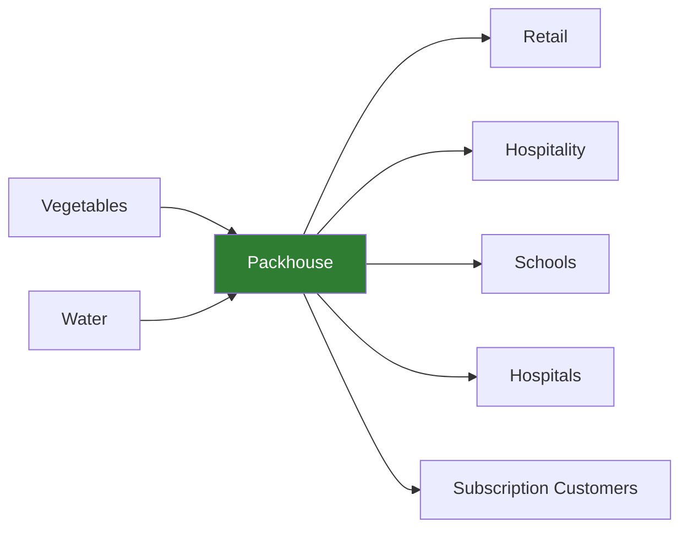

---

# Phase 2 Outcomes

- Production capacity triples.
- Water purification increases to 25,000 litres/day.
- Distribution expands across the Eastern Cape.
- Greenhouse footprint exceeds 3,000 m².
- Renewable energy supplies the majority of operational demand.
- Institutional contracts become a major revenue source.

---

# 9. Phase 3 Capital Budget (Regional AgriHub)

## Strategic Objective

Phase 3 transforms the enterprise into a fully integrated regional agricultural hub, incorporating advanced production technologies, high-value crop systems, and large-scale water distribution while positioning the business for replication across Southern Africa.

---

## Phase 3 Capital Allocation

| Category | Description | Estimated Cost (ZAR) |
|-----------|-------------|---------------------:|
| Hydroponic Systems | Controlled Environment Agriculture (CEA) | 1,100,000 |
| Solar Expansion | Increase capacity to 75 kW | 950,000 |
| Water Distribution Fleet | Bulk tanker and institutional delivery | 700,000 |
| Nursery & Research Centre | Commercial propagation and R&D | 400,000 |

| **Total Phase 3 Investment** | | **R3,150,000** |

---

## Regional Hub Architecture

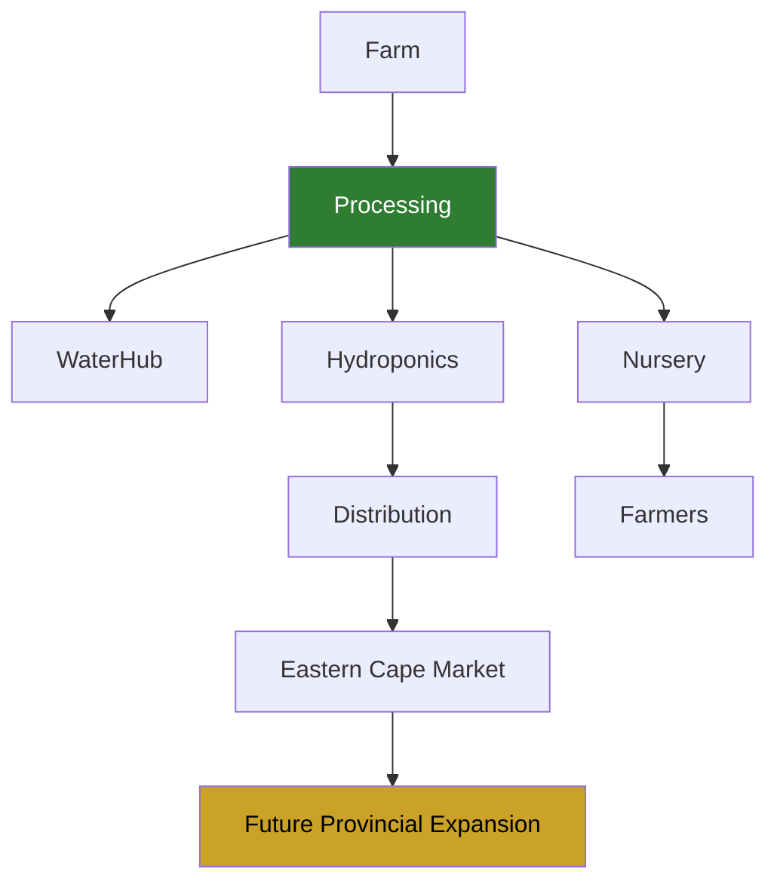

---

# Phase 3 Outcomes

- Full energy independence.
- Regional bulk water distribution.
- Commercial hydroponic production.
- Seedling supply to third-party farmers.
- Agricultural research and innovation.
- Replicable AgriHub model.

---

# 10. Startup Equipment Register

## Procurement Philosophy

The AgriHub will procure durable, commercial-grade infrastructure that supports long-term operational efficiency and scalability. Equipment selection will prioritise lifecycle cost, local serviceability, energy efficiency, and compatibility with future expansion phases.

---

## Equipment Register

| Category | Equipment | Qty | Phase | Estimated Cost (ZAR) | Status |
|-----------|-----------|----:|------:|---------------------:|--------|
| Agriculture | Multi-span Greenhouse Tunnels (1,000 m²) | 1 | 1 | 1,100,000 | Planned |
| Agriculture | Tractor (60–75 HP) | 1 | 2 | 750,000 | Planned |
| Agriculture | Rotavator | 1 | 1 | 80,000 | Planned |
| Agriculture | Brush Cutters | 4 | 1 | 24,000 | Planned |
| Agriculture | Ride-on Mower | 1 | 1 | 120,000 | Planned |
| Agriculture | Seedling Trays | 500 | 1 | 35,000 | Planned |
| Agriculture | Shade Net Structures | 2 | 2 | 450,000 | Planned |
| Irrigation | Drip Irrigation Network | Site-wide | 1 | 320,000 | Planned |
| Irrigation | Booster Pumps | 2 | 1 | 95,000 | Planned |
| Water | RO Purification Plant (10 kL/day) | 1 | 1 | 650,000 | Planned |
| Water | Water Storage Tanks | 4 × 10 kL | 1 | 180,000 | Planned |
| Water | Bulk Water Tanker | 1 | 3 | 700,000 | Planned |
| Solar | PV Array (5–75 kW) | Modular | 1–3 | 2,150,000 | Planned |
| Solar | Battery Storage | Modular | 1–3 | Included | Planned |
| Cold Chain | Walk-in Cold Room | 1 | 1 | 300,000 | Planned |
| Logistics | Delivery Bakkie | 1 | 1 | 550,000 | Planned |
| Logistics | Refrigerated Truck | 1 | 3 | 1,100,000 | Planned |
| Office | Computers & Networking | 5 | 1 | 90,000 | Planned |
| Security | CCTV & Alarm System | 1 | 1 | 60,000 | Planned |
| Security | Electric Fence | Site-wide | 1 | 180,000 | Planned |
| Agritech | Weather Station | 1 | 2 | 45,000 | Planned |
| Agritech | Soil Moisture Sensors | Multiple | 2 | 65,000 | Planned |
| Agritech | Agricultural Drone | 1 | 3 | 180,000 | Planned |
| Agritech | Farm Management ERP Software | 1 | 2 | 120,000 | Planned |

---

## Capital Deployment Timeline

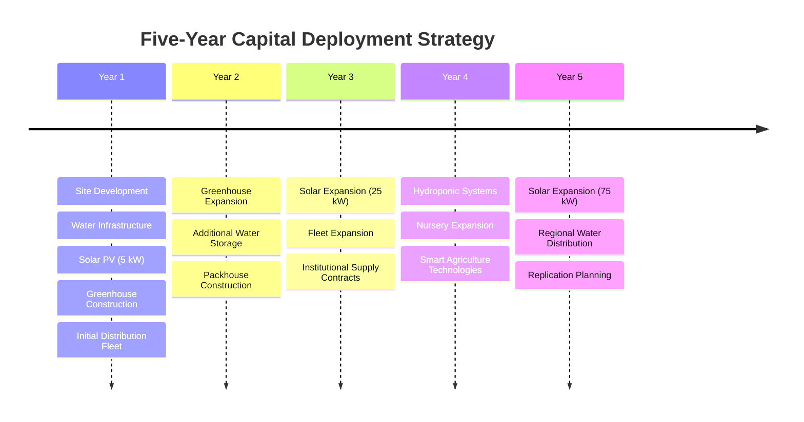

---

## Total Capital Investment

| Phase | Investment (ZAR) |
|--------|-----------------:|
| Phase 1 | R4,850,000 |
| Phase 2 | R4,500,000 |
| Phase 3 | R3,150,000 |
| **Total Programme Investment** | **R12,500,000** |

The phased capital deployment strategy ensures that each investment tranche is linked to measurable operational milestones, reducing execution risk while creating a scalable, resilient agribusiness platform capable of long-term growth and regional replication.
---
# 11. Procurement Schedule

## Procurement Philosophy

The Eastern Cape Integrated AgriHub will follow a phased procurement strategy designed to maximise capital efficiency, reduce project risk, and align infrastructure investment with operational growth.

Procurement will prioritise:

- Local suppliers where commercially competitive.
- South African manufactured equipment where feasible.
- Durable, commercial-grade infrastructure.
- Energy-efficient technologies.
- Modular systems capable of future expansion.
- Competitive quotation processes.
- Compliance with grant and DFI procurement policies.

Infrastructure procurement will occur only once predefined operational milestones have been achieved.

---

## Procurement Workflow


---

## Phase 1 Procurement Schedule (Year 1)

| Quarter | Procurement Activity | Purpose |
|-----------|------------------------------|------------------------------|
| Q1 | Land preparation & fencing | Site establishment |
| Q1 | Borehole feasibility study & hydrogeological survey | Confirm groundwater potential |
| Q1 | Rainwater harvesting infrastructure | Water resilience |
| Q1 | Water storage tanks | Water reserve |
| Q2 | Greenhouse tunnels | Protected cultivation |
| Q2 | Drip irrigation system | Efficient irrigation |
| Q2 | Reverse Osmosis Plant | Water purification |
| Q2 | Solar PV System (5 kW) | Energy resilience |
| Q3 | Walk-in Cold Room | Produce preservation |
| Q3 | Delivery Vehicle (Bakkie) | Distribution |
| Q3 | Nursery Infrastructure | Seedling production |
| Q4 | Office & ICT Equipment | Administration |
| Q4 | CCTV & Security Systems | Asset protection |

---

## Phase 2 Procurement Schedule (Years 2–3)

| Quarter | Procurement Activity | Purpose |
|-----------|-----------------------------|------------------------------|
| Q1 | Additional Greenhouse Tunnels | Production expansion |
| Q1 | Shade Net Structures | Climate protection |
| Q2 | 25 kW Solar Expansion | Energy independence |
| Q2 | Battery Energy Storage | Off-grid operations |
| Q2 | Additional Water Storage | Commercial supply |
| Q3 | Packhouse Construction | Sorting & packaging |
| Q3 | Refrigerated Distribution Vehicle | Cold-chain logistics |
| Q4 | Retail Packaging Equipment | Value addition |

---

## Phase 3 Procurement Schedule (Years 4–5)

| Quarter | Procurement Activity | Purpose |
|-----------|------------------------------|------------------------------|
| Q1 | Hydroponic Systems | High-value crops |
| Q2 | 75 kW Solar Expansion | Full energy independence |
| Q2 | Bulk Water Tanker | Institutional supply |
| Q3 | Commercial Nursery Expansion | Seedling sales |
| Q3 | Drone Monitoring Systems | Precision agriculture |
| Q4 | Smart Irrigation Sensors | AI-assisted irrigation |
| Q4 | Agricultural ERP Software | Enterprise management |

---

# 12. Operating Expenses (OPEX)

## Operating Philosophy

The AgriHub has been designed to maintain a lean operating structure during Phase 1 while gradually increasing operational expenditure in line with revenue growth.

Operational efficiency will be driven through:

- Solar-powered infrastructure.
- Automated irrigation.
- Water recycling.
- Local procurement.
- Direct-to-consumer distribution.
- Preventative maintenance.

---

## Annual Operating Expense Categories

| Category | Description |
|-----------|-------------|
| Salaries & Wages | Permanent and seasonal staff |
| Seeds & Seedlings | Crop inputs |
| Fertilisers & Soil Amendments | Agricultural production |
| Water Treatment Chemicals | RO plant operation |
| Packaging | Produce & bottled water |
| Fuel & Logistics | Distribution fleet |
| Solar Maintenance | Cleaning & servicing |
| Equipment Maintenance | Farm infrastructure |
| ICT & Communications | Internet, software, phones |
| Insurance | Assets & public liability |
| Marketing | Branding & customer acquisition |
| Professional Services | Legal, accounting & compliance |

---

## Five-Year Operating Expense Forecast (ZAR)

| Expense Category | Year 1 | Year 2 | Year 3 | Year 4 | Year 5 |
|-----------------|--------:|--------:|--------:|--------:|--------:|
| Salaries & Wages | 850,000 | 1,650,000 | 3,600,000 | 5,400,000 | 7,800,000 |
| Agricultural Inputs | 520,000 | 1,100,000 | 2,250,000 | 3,500,000 | 5,400,000 |
| Packaging | 240,000 | 510,000 | 1,120,000 | 1,850,000 | 2,900,000 |
| Fuel & Logistics | 140,000 | 310,000 | 680,000 | 1,100,000 | 1,650,000 |
| Solar Maintenance | 110,000 | 220,000 | 520,000 | 780,000 | 1,100,000 |
| Insurance | 85,000 | 120,000 | 180,000 | 240,000 | 320,000 |
| ICT & Communications | 45,000 | 60,000 | 95,000 | 130,000 | 180,000 |
| Marketing & Sales | 140,000 | 260,000 | 510,000 | 750,000 | 1,020,000 |
| Professional Services | 95,000 | 130,000 | 220,000 | 320,000 | 450,000 |
| Miscellaneous & Contingency | 55,000 | 80,000 | 150,000 | 250,000 | 350,000 |

---

## Operating Cost Allocation

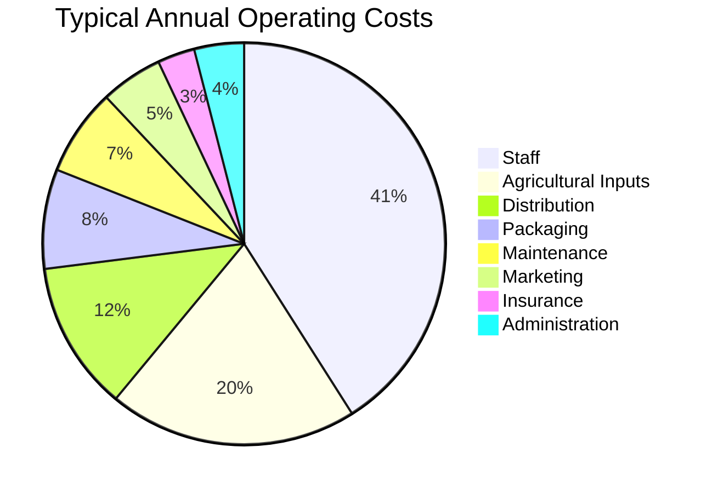

---

# 13. Staffing Plan

## Human Capital Philosophy

People are the most valuable asset of the AgriHub.

Recruitment will prioritise:

- Local employment.
- Youth development.
- Women in agriculture.
- Skills transfer.
- Continuous professional development.

---

## Organisational Structure

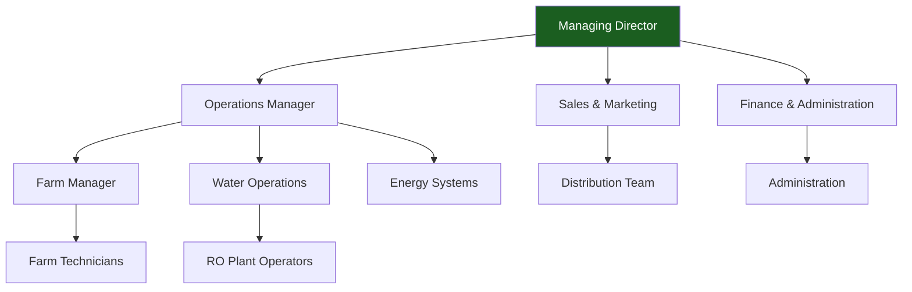

---

## Staffing Growth Plan

| Position | Phase 1 | Phase 2 | Phase 3 |
|------------|--------:|--------:|--------:|
| Managing Director | 1 | 1 | 1 |
| Operations Manager | 1 | 1 | 1 |
| Finance/Admin | 1 | 2 | 3 |
| Farm Manager | 1 | 2 | 3 |
| Farm Technicians | 4 | 8 | 12 |
| Water Operators | 1 | 2 | 4 |
| Drivers | 1 | 3 | 5 |
| Sales & Marketing | 1 | 2 | 3 |
| Nursery Staff | 0 | 2 | 4 |
| Security | 2 | 2 | 4 |

---

## Employment Growth

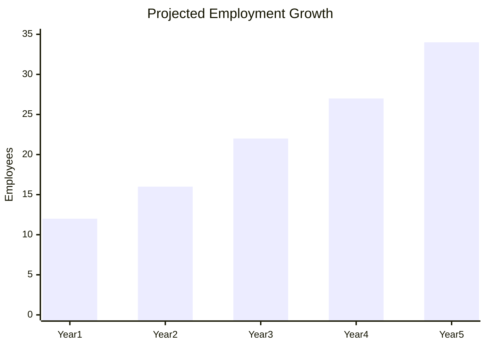

---

# 14. Five-Year Financial Forecast

## Revenue Forecast (ZAR)

| Revenue Stream | Year 1 | Year 2 | Year 3 | Year 4 | Year 5 |
|----------------|--------:|--------:|--------:|--------:|--------:|
| Vegetables | 1,450,000 | 2,900,000 | 5,800,000 | 8,900,000 | 12,600,000 |
| Water Supply | 950,000 | 2,100,000 | 4,800,000 | 8,200,000 | 15,500,000 |
| Subscription Boxes | 324,000 | 950,000 | 1,890,000 | 3,100,000 | 4,320,000 |
| Nursery | 180,000 | 350,000 | 700,000 | 1,100,000 | 1,600,000 |
| Consulting & Training | 170,000 | 400,000 | 900,000 | 1,400,000 | 2,200,000 |

### Total Revenue

| Year | Revenue |
|-------|---------:|
| Year 1 | **R3,074,000** |
| Year 2 | **R6,700,000** |
| Year 3 | **R14,090,000** |
| Year 4 | **R22,700,000** |
| Year 5 | **R36,220,000** |

---

## Revenue Growth

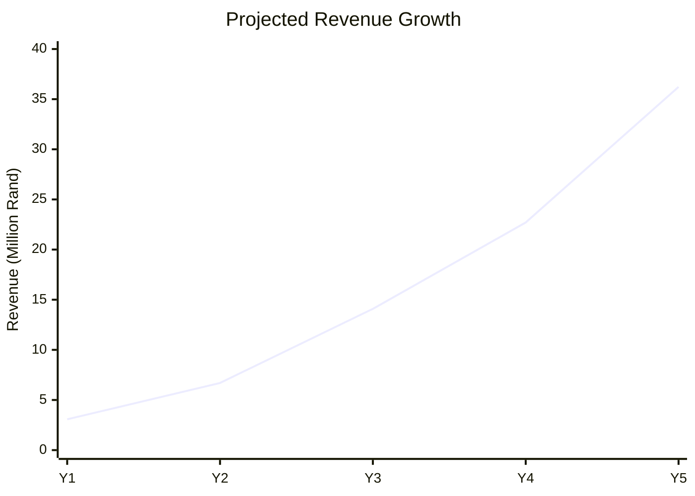

---

## EBITDA Forecast

| Year | EBITDA | Margin |
|-------|--------:|-------:|
| Year 1 | R894,000 | 29.1% |
| Year 2 | R2,340,000 | 34.9% |
| Year 3 | R4,830,000 | 34.3% |
| Year 4 | R8,500,000 | 37.4% |
| Year 5 | R15,200,000 | 42.0% |

---

## Net Profit After Tax (NPAT)

| Year | NPAT |
|-------|------:|
| Year 1 | R397,120 |
| Year 2 | R1,306,700 |
| Year 3 | R2,905,400 |
| Year 4 | R5,584,500 |
| Year 5 | R10,475,500 |

---

## Financial Outlook

By Year 5, the Eastern Cape Integrated AgriHub is projected to have evolved from a pilot-scale climate-smart agricultural enterprise into a diversified regional agribusiness with multiple recurring revenue streams, strong operating margins, and positive cash generation.

The phased investment strategy enables infrastructure to expand alongside verified market demand, supporting long-term financial sustainability while reducing capital risk for investors and funding partners.

---

# 15. Cash Flow Forecast

## Cash Flow Management Philosophy

The financial sustainability of the Eastern Cape Integrated AgriHub is founded on disciplined cash flow management. While accounting profits indicate long-term business performance, cash flow determines operational resilience, debt servicing capability, and the ability to finance future expansion.

The project adopts a phased investment approach where capital expenditure is aligned with operational milestones, reducing liquidity risk during the early stages of growth.

Cash generated from operations will first be allocated toward:

1. Operating expenses
2. Staff remuneration
3. Maintenance and replacement reserves
4. Debt servicing (if applicable)
5. Capital reinvestment
6. Expansion projects

---

## Cash Flow Cycle

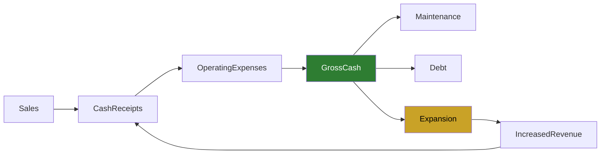

---

# Operating Cash Flow Forecast (ZAR)

| Cash Flow Item | Year 1 | Year 2 | Year 3 | Year 4 | Year 5 |
|----------------|--------:|--------:|--------:|--------:|--------:|
| Revenue | 3,074,000 | 6,700,000 | 14,090,000 | 22,700,000 | 36,220,000 |
| Operating Cash Receipts | 2,920,300 | 6,365,000 | 13,385,500 | 21,565,000 | 34,409,000 |
| Operating Expenses | (1,280,000) | (2,440,000) | (5,210,000) | (7,750,000) | (11,070,000) |
| Working Capital Changes | (350,000) | (450,000) | (700,000) | (850,000) | (1,100,000) |
| Net Operating Cash Flow | **1,290,300** | **3,475,000** | **7,475,500** | **12,965,000** | **22,239,000** |

---

# Investing Cash Flow

| Item | Year 1 | Year 2 | Year 3 | Year 4 | Year 5 |
|------|--------:|--------:|--------:|--------:|--------:|
| Phase 1 Infrastructure | (4,850,000) | - | - | - | - |
| Phase 2 Expansion | - | (2,250,000) | (2,250,000) | - | - |
| Phase 3 Expansion | - | - | - | (1,575,000) | (1,575,000) |
| Equipment Replacement Reserve | - | (150,000) | (250,000) | (350,000) | (500,000) |

---

# Financing Cash Flow

| Item | Year 1 | Year 2 | Year 3 | Year 4 | Year 5 |
|------|--------:|--------:|--------:|--------:|--------:|
| Grants | 2,000,000 | 750,000 | - | - | - |
| Equity | 1,500,000 | 500,000 | - | - | - |
| Concessional Debt | 1,350,000 | 1,000,000 | 1,250,000 | 750,000 | - |
| Debt Repayment | - | (250,000) | (500,000) | (850,000) | (1,200,000) |

---

## Net Cash Position

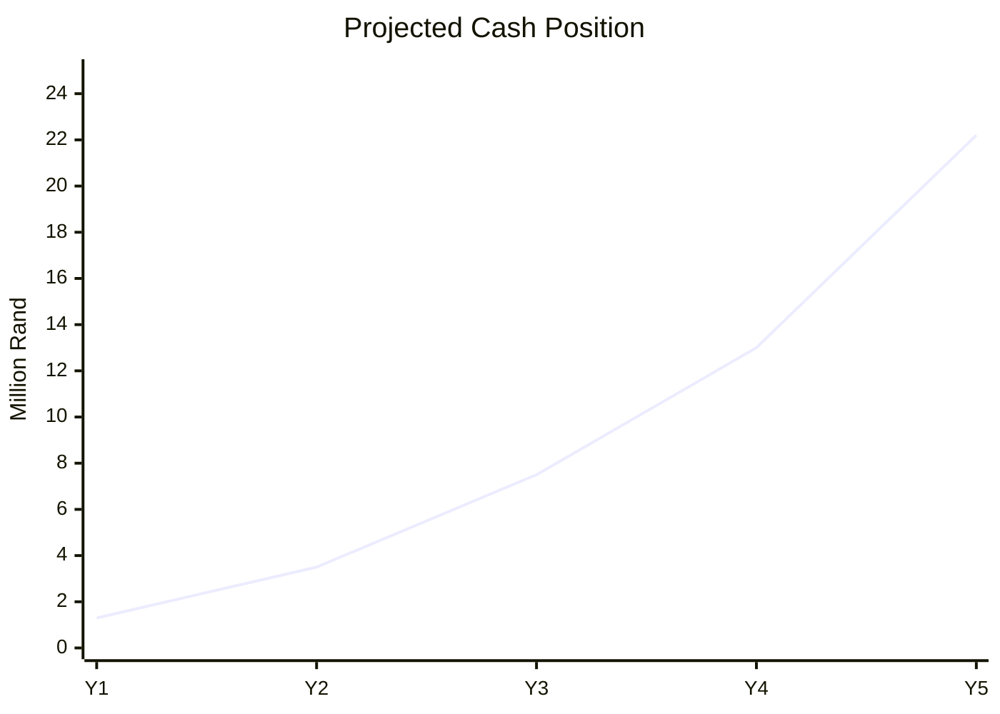

---

# Cash Reserve Policy

The business will maintain a minimum operating cash reserve equivalent to:

- Six months of salaries.
- Six months of production inputs.
- Three months of debt obligations.
- One complete production cycle.
- Emergency infrastructure repairs.

Target Reserve:

**R1.5 million by Year 3**

---

# 16. Forecast Balance Sheet

## Balance Sheet Philosophy

The AgriHub is capital intensive during its early years, transitioning into an asset-rich and cash-generative enterprise as infrastructure becomes fully operational.

Asset growth is expected to outpace liabilities from Year 3 onwards.

---

## Projected Balance Sheet (ZAR)

### Assets

| Assets | Year 1 | Year 2 | Year 3 | Year 4 | Year 5 |
|---------|--------:|--------:|--------:|--------:|--------:|
| Cash | 1,290,300 | 3,475,000 | 7,475,500 | 12,965,000 | 22,239,000 |
| Inventory | 320,000 | 620,000 | 1,100,000 | 1,650,000 | 2,250,000 |
| Property, Plant & Equipment | 4,500,000 | 6,700,000 | 8,850,000 | 10,950,000 | 12,800,000 |
| Accounts Receivable | 280,000 | 620,000 | 1,120,000 | 1,750,000 | 2,550,000 |

### Total Assets

| Year | Total Assets |
|-------|-------------:|
| Year 1 | **R6,390,300** |
| Year 2 | **R11,415,000** |
| Year 3 | **R18,545,500** |
| Year 4 | **R27,315,000** |
| Year 5 | **R39,839,000** |

---

### Liabilities

| Liability | Year 1 | Year 2 | Year 3 | Year 4 | Year 5 |
|------------|--------:|--------:|--------:|--------:|--------:|
| Accounts Payable | 220,000 | 360,000 | 620,000 | 850,000 | 1,150,000 |
| Long-Term Debt | 1,350,000 | 2,100,000 | 2,850,000 | 2,500,000 | 1,900,000 |

---

### Shareholders' Equity

| Component | Year 5 |
|------------|--------:|
| Share Capital | 1,500,000 |
| Retained Earnings | 36,439,000 |
| Total Equity | **R37,939,000** |

---

## Asset Growth

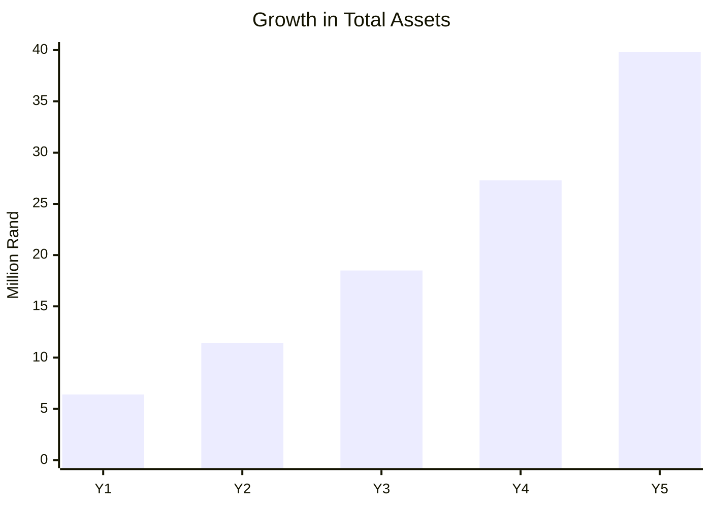

---

# 17. EBITDA Analysis

##

EBITDA measures the underlying operating profitability of the AgriHub before accounting for financing decisions, taxation, and non-cash depreciation.

This metric is widely used by:

- Commercial Banks
- DFIs
- Private Equity
- Impact Investors
- Infrastructure Funds

---

## EBITDA Growth

| Year | EBITDA | Margin |
|-------|--------:|--------:|
| Year 1 | 894,000 | 29.1% |
| Year 2 | 2,340,000 | 34.9% |
| Year 3 | 4,830,000 | 34.3% |
| Year 4 | 8,500,000 | 37.4% |
| Year 5 | 15,200,000 | 42.0% |

---

## EBITDA Trend

```mermaid
xychart-beta

title "EBITDA Growth"

x-axis [Y1,Y2,Y3,Y4,Y5]

y-axis "Million Rand" 0 --> 16

line [0.89,2.34,4.83,8.50,15.20]
```

---

## EBITDA Drivers

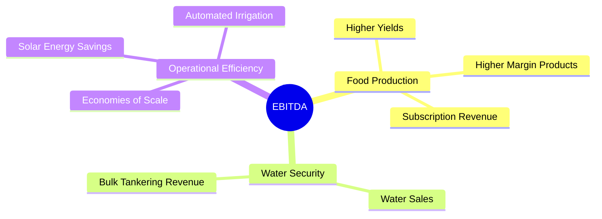

---

# 18. Breakeven Analysis

## Financial Objective

The objective of Phase 1 is to achieve operational breakeven before the end of the first production year.

Annual Fixed Costs:

**R1,630,000**

Average Gross Margin:

**70.7%**


::contentReference[oaicite:0]{index=0}


Annual Breakeven Revenue:

> **≈ R2.31 million**

Equivalent Monthly Revenue:

> **≈ R192,000**

---

## Breakeven Timeline

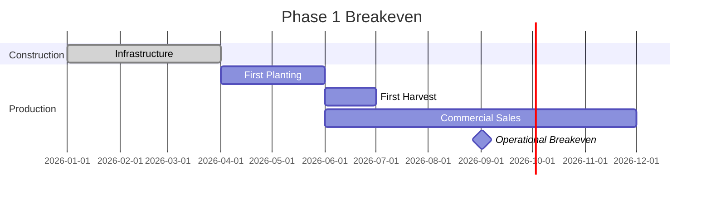

---

# 19. Sensitivity Analysis

## Scenario Planning

To evaluate financial resilience, three operating scenarios have been modelled.

| Variable | Conservative | Base Case | High Growth |
|-----------|-------------:|----------:|------------:|
| Revenue Growth | 10% | 22% | 35% |
| Gross Margin | 63% | 71% | 75% |
| EBITDA Margin | 20% | 34% | 45% |
| Customer Growth | Slow | Expected | Accelerated |
| Expansion Pace | Delayed | Planned | Early |

---

## Revenue Sensitivity

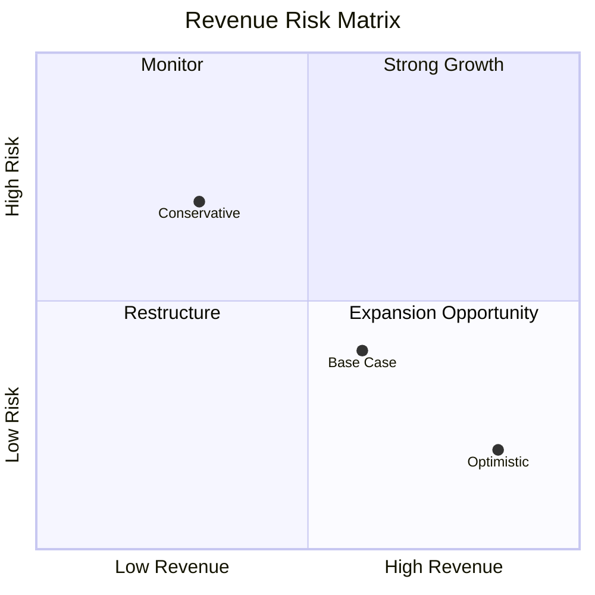

---

## Risk Mitigation Strategy

| Risk | Mitigation |
|------|------------|
| Drought | Borehole (subject to hydrogeological feasibility), rainwater harvesting, and bulk storage |
| Municipal Water Interruptions | On-site purification, storage tanks, diversified water sources |
| Electricity Outages | Hybrid solar PV with battery backup |
| Input Cost Inflation | Long-term supplier agreements and bulk purchasing |
| Crop Failure | Greenhouses, crop diversification, climate-smart practices |
| Customer Concentration | Balanced mix of households, institutions, hospitality, and retail clients |
| Financing Delays | Phased capital deployment and staged procurement |

---

## Financial Outlook

Under the base-case assumptions, the Eastern Cape Integrated AgriHub reaches operational breakeven within the first year, becomes consistently cash-flow positive thereafter, and expands into a diversified, asset-backed agribusiness by Year 5. The phased investment strategy, strong projected EBITDA margins, and multiple revenue streams provide resilience against market volatility while positioning the business for long-term regional growth and replication.

---

# 20. Funding Strategy & Capital Structure

## Capital Strategy

The Garden Route Integrated AgriHub will utilise a phased blended-finance approach, combining grant funding, founder equity, concessional debt, and commercial finance to minimise financial risk while maximising long-term sustainability.

Rather than relying on a single large funding event, the project is designed so that each investment phase unlocks the next stage of expansion through demonstrated operational performance and measurable impact.

---

## Funding Philosophy

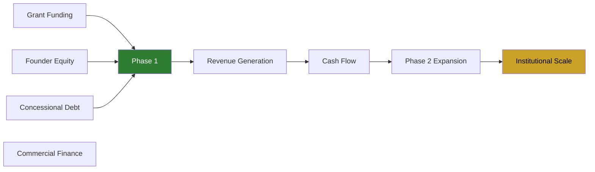

---

## Capital Structure

| Funding Instrument | Purpose | Target Share |
|--------------------|---------|-------------:|
| Grant Funding | Infrastructure & community impact | 35–40% |
| Founder Equity | Equity contribution & investor confidence | 20–30% |
| Concessional Debt | Long-term infrastructure finance | 20–30% |
| Commercial Debt | Expansion capital | 5–15% |
| Retained Earnings | Organic growth | Increasing annually |

---

## Phase Funding Plan

| Phase | Capital Required | Funding Focus |
|--------|----------------:|--------------|
| Phase 1 | R4.85 million | Grants, founder equity, concessional finance |
| Phase 2 | R4.50 million | Cash flow, blended finance, bank facilities |
| Phase 3 | R3.15 million | Internal cash generation & institutional finance |

---

## Funding Principles

- Preserve long-term ownership.
- Avoid unnecessary shareholder dilution.
- Match long-life assets with long-term funding.
- Use grant capital for public-benefit infrastructure.
- Use commercial debt only for revenue-generating assets.
- Reinvest profits before seeking additional equity.

---

# 21. Funding Sources & Blended Finance

## Potential Funding Partners

The project aligns strongly with organisations supporting climate-smart agriculture, food security, renewable energy, water resilience, youth employment, and rural development.

---

## Government Funding

| Institution | Potential Purpose |
|--------------|------------------|
| Department of Agriculture | Agricultural infrastructure |
| CASP Programme | Farm development |
| AgriBEE Fund | Black farmer support |
| Department of Water & Sanitation | Water resilience |
| Industrial Development Corporation (IDC) | SME expansion |
| Land Bank | Agricultural finance |
| Eastern Cape Development Corporation (ECDC) | Regional business support |

---

## Development Finance Institutions (DFIs)

| Institution | Funding Focus |
|--------------|--------------|
| African Enterprise Challenge Fund (AECF) | Climate-smart agriculture |
| Development Bank of Southern Africa (DBSA) | Infrastructure |
| African Development Bank (AfDB) | Food systems |
| International Finance Corporation (IFC) | Agribusiness |
| Green Climate Fund (GCF) | Climate adaptation |
| Global Environment Facility (GEF) | Environmental sustainability |
| USAID | Agricultural development |
| European Union Development Programmes | Rural resilience |

---

## Private Impact Investors

| Investor Type | Investment Thesis |
|---------------|------------------|
| ESG Funds | Climate resilience |
| Family Offices | Long-term agriculture |
| Impact Investment Funds | Food security |
| Green Investment Funds | Renewable energy |
| Social Enterprise Investors | Community development |

---

## Blended Finance Model

```mermaid
pie title Proposed Phase 1 Funding Mix

"Grant Funding" : 41

"Founder Equity" : 31

"Concessional Debt" : 28
```

---

## Funding Allocation

| Funding Source | Primary Use |
|----------------|------------|
| Grants | Water systems, solar infrastructure, community assets |
| Equity | Working capital and governance |
| Debt | Productive revenue-generating assets |
| Internal Cash Flow | Future expansion |

---

# 22. Investor Returns & Exit Strategy

## Investment Philosophy

The Garden Route Integrated AgriHub has been structured to generate both measurable financial returns and significant environmental and social impact.

Investors benefit from diversified revenue streams, growing asset values, and predictable long-term cash generation.

---

## Financial Performance

| Metric | Value |
|---------|------:|
| Five-Year Revenue | R36.22 million |
| EBITDA Margin | 42% |
| Gross Margin | 72% |
| Net Profit | R10.48 million |
| Estimated IRR | 31.2% |
| Payback Period | 2.8 Years |

---

## Investor Value Creation

```mermaid
flowchart LR

Investment

--> Infrastructure

--> Revenue

--> Cash Flow

--> Expansion

--> Higher Valuation

--> Investor Returns

style InvestorReturns fill:#2E7D32,color:#fff
```

---

## Exit Options

### Strategic Acquisition

Potential acquisition by:

- Commercial farming groups
- Agricultural investment companies
- Water infrastructure companies
- Renewable energy operators

---

### Management Buy-Out

Founder and management team purchase investor shares using retained earnings.

---

### Secondary Investment

Institutional investors purchase early-stage investor equity during Phase 3 expansion.

---

### Long-Term Dividend Strategy

Rather than exiting completely, investors may elect to retain ownership and receive annual dividend distributions funded through operational cash flow.

---

## Dividend Policy

The company intends to adopt the following policy once expansion capital requirements have stabilised:

- 30–40% retained earnings reinvested
- 60–70% available for dividends (subject to board approval and liquidity requirements)

---

# 23. Financial Risk Assessment

## Risk Management Framework

The AgriHub follows an enterprise risk management framework integrating operational, financial, environmental, and strategic risks.

---

## Financial Risk Matrix

| Risk | Probability | Impact | Mitigation |
|------|------------|---------|------------|
| Drought | Medium | High | Borehole (subject to hydrogeological feasibility), rainwater harvesting, storage |
| Load Shedding | High | Medium | Hybrid solar PV with battery backup |
| Municipal Water Interruptions | High | High | On-site purification and storage |
| Inflation | Medium | Medium | Long-term supplier agreements |
| Interest Rate Increases | Medium | Medium | Concessional financing |
| Customer Concentration | Low | Medium | Diversified customer portfolio |
| Crop Disease | Medium | High | Protected cultivation & crop rotation |
| Regulatory Change | Low | Medium | Ongoing compliance monitoring |
| Equipment Failure | Medium | Medium | Preventive maintenance programme |

---

## Risk Heat Map

```mermaid
quadrantChart

title Financial Risk Matrix

x-axis Low Probability --> High Probability

y-axis Low Impact --> High Impact

quadrant-1 Monitor

quadrant-2 Critical

quadrant-3 Low Priority

quadrant-4 Manage

Drought:[0.75,0.95]

Water Interruptions:[0.90,0.95]

Inflation:[0.60,0.60]

Equipment Failure:[0.45,0.50]

Customer Loss:[0.25,0.45]
```

---

## Business Continuity Strategy

The integrated business model provides resilience through:

- Multiple independent revenue streams.
- Solar-powered operations.
- Protected agriculture.
- Diversified customer segments.
- Long-term supply agreements.
- Water storage and purification capacity.
- Phased infrastructure expansion.

---

# 24. Financial Assumptions

## Overview

The financial projections contained within this business plan are based on conservative market assumptions, current industry benchmarks, and phased operational growth.

The model is intended to demonstrate commercial viability while recognising that actual performance will depend on market conditions, operational execution, financing availability, and regulatory compliance.

---

## Core Assumptions

| Assumption | Value |
|------------|------:|
| Planning Horizon | 5 Years |
| Corporate Income Tax | 27% |
| Inflation | 5–6% per annum |
| Revenue Growth | 22% average |
| Gross Margin | 70–72% |
| EBITDA Margin | 29–42% |
| Debt Interest Rate | 8–10% |
| Depreciation | Straight-line |
| Collection Period | 30 Days |
| Supplier Payment Period | 30 Days |

---

## Operational Assumptions

- Agricultural production increases progressively through phased infrastructure expansion.
- Water purification capacity scales from 10,000 L/day to commercial volumes.
- Solar capacity expands in line with operational energy demand.
- Subscription customers increase each year through targeted community engagement.
- Institutional contracts contribute an increasing share of revenue from Phase 2 onward.
- Working capital is sufficient to support seasonal production cycles.
- Capital expenditure is phased to align with funding availability and market demand.
- Industrial hemp activities will only commence if legally permitted and all required licences and regulatory approvals have been obtained.

---

## Financial Planning Principles

```mermaid
mindmap
root((Financial Model))

Conservative Revenue

Phased Growth

Diversified Income

Strong Cash Flow

Infrastructure First

Low Debt Risk

Community Impact

Long-Term Sustainability
```

---

## Conclusion

The financial model demonstrates that the Garden Route Integrated AgriHub can evolve into a profitable, asset-backed, climate-resilient agribusiness through disciplined capital deployment, diversified revenue generation, and prudent financial management. By combining commercial agriculture, water infrastructure, renewable energy, and community-focused services, the project is positioned to deliver sustainable financial returns while contributing meaningfully to food security, climate adaptation, and inclusive economic development in the Eastern Cape.
