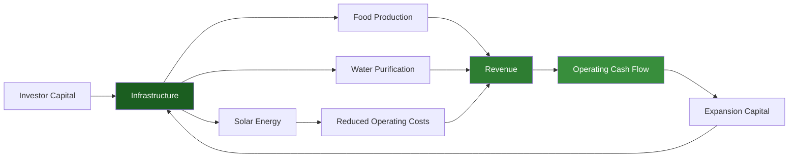
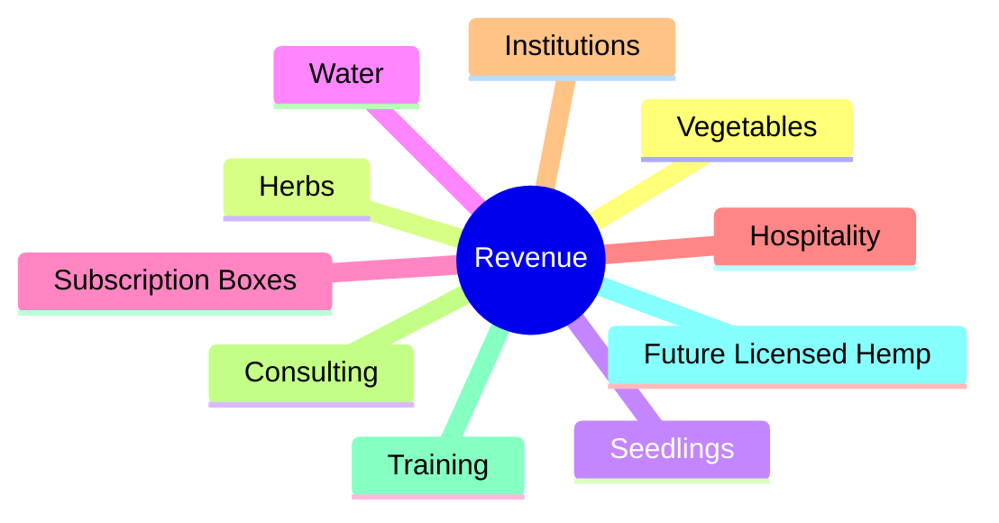

# 05 Financial Model

> **NACIRFA DREAM GROUP (PTY) LTD**
>
> **Eastern Cape Integrated AgriHub**
>
> **Document ID:** NDG-FM-2026-V1.0
>
> **Classification:** Commercial in Confidence

---

# Table of Contents

1. Executive Financial Summary
2. Financial Philosophy
3. Business Units & Revenue Model
4. Revenue Streams
5. Operating Model
6. Phased Capital Strategy
7. Phase 1 Capital Budget
8. Phase 2 Capital Budget
9. Phase 3 Capital Budget
10. Startup Equipment Register
11. Procurement Schedule
12. Operating Expenses
13. Staffing Plan
14. Five-Year Financial Forecast
15. Cash Flow Forecast
16. Balance Sheet Forecast
17. EBITDA Analysis
18. Breakeven Analysis
19. Sensitivity Analysis
20. Funding Strategy
21. Funding Sources
22. Investor Returns
23. Financial Risks
24. Assumptions

# 1. Executive Financial Summary

The Eastern Cape Integrated AgriHub has been structured as a phased infrastructure investment designed to minimise capital risk while maximising long-term enterprise value.

Rather than constructing the full agricultural ecosystem at inception, infrastructure is deployed in modular phases that are activated only after operational and commercial milestones have been achieved.

This approach:

- Reduces initial capital requirements.
- Improves grant eligibility.
- Limits debt exposure.
- Allows proof of concept before major expansion.
- Supports positive operational cash flow earlier in the project lifecycle.
- Aligns with the funding methodologies commonly used by development finance institutions and blended finance programmes.

The business combines multiple complementary income streams to reduce reliance on any single market segment.

---

# 2. Financial Philosophy

The financial model is based on five core principles:

1. **Capital Efficiency** – Invest only in infrastructure required for the next stage of growth.
2. **Diversification** – Build multiple revenue streams to reduce earnings volatility.
3. **Resilience** – Reduce dependence on municipal water and grid electricity.
4. **Scalability** – Design assets that can be replicated in additional locations.
5. **Sustainability** – Balance profitability with measurable environmental and social outcomes.

---

# 3. Business Units & Revenue Model

Revenue is generated from several complementary business units.

| Business Unit | Revenue Type | Frequency |
|---------------|--------------|-----------|
| Vegetable Production | Produce sales | Daily / Weekly |
| Herbs & Specialty Crops | Produce sales | Weekly |
| Seedling Nursery | Seedling sales | Seasonal |
| Water Purification | Bulk and bottled water | Daily |
| Vegetable Subscription Boxes | Subscription | Monthly |
| Hospitality Supply | Contract sales | Weekly |
| Institutional Supply | Contract sales | Monthly |
| Agricultural Consulting | Service fees | Project-based |
| Training & Incubation | Course fees / grants | Quarterly |
| Future Hemp Operations* | Licensed products | Ongoing |

\*Subject to South African legislation and licensing requirements.

---

# 4. Phased Capital Strategy

Infrastructure investment is divided into three phases.

Each phase is funded only after key operational targets are achieved, reducing investor risk.

---

# 5. Phase 1 Capital Budget

**Objective:** Establish a commercially viable pilot operation with sufficient production capacity to validate demand, refine operating procedures, and generate recurring cash flow.

| Category | Purpose | Estimated Cost (ZAR) |
|-----------|---------|---------------------:|
| Land Preparation & Fencing | Site development and security | 450,000 |
| Greenhouse Tunnels (1,000 m²) | Protected cultivation | 1,100,000 |
| Water Infrastructure | Rainwater harvesting, storage, RO plant | 850,000 |
| Solar PV (5 kW) | Irrigation and water pumping | 350,000 |
| Cold Storage | Produce preservation | 300,000 |
| Delivery Vehicle | Distribution | 550,000 |
| Working Capital | Salaries, seed, compliance, operations | 1,250,000 |

**Total Phase 1 Capital Requirement:** **R4,850,000**

---

# 6. Startup Equipment Register

| Category | Equipment | Quantity | Phase | Status |
|-----------|-----------|---------:|------:|--------|
| Agriculture | Greenhouse Tunnels | 1,000 m² | 1 | Planned |
| Agriculture | Tractor (50–75 HP) | 1 | 2 | Planned |
| Agriculture | Brush Cutters | 4 | 1 | Planned |
| Agriculture | Rotavator | 1 | 1 | Planned |
| Agriculture | Seedling Trays | 500 | 1 | Planned |
| Water | Reverse Osmosis Plant | 10 kL/day | 1 | Planned |
| Water | Storage Tanks | 4 × 10 kL | 1 | Planned |
| Water | Booster Pumps | 2 | 1 | Planned |
| Solar | PV Array | 5–75 kW | 1–3 | Planned |
| Solar | Battery Storage | 1 Bank | 1 | Planned |
| Cold Chain | Walk-in Cold Room | 1 | 1 | Planned |
| Logistics | Bakkie | 1 | 1 | Planned |
| Logistics | Refrigerated Truck | 1 | 3 | Planned |
| Agritech | Weather Station | 1 | 2 | Planned |
| Agritech | Soil Moisture Sensors | Multiple | 2 | Planned |
| Agritech | Drone | 1 | 3 | Planned |
| Office | Computers | 5 | 1 | Planned |
| Security | CCTV System | 1 | 1 | Planned |
| Security | Electric Fence | 1 | 1 | Planned |
