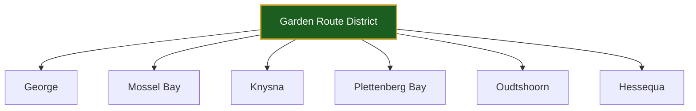
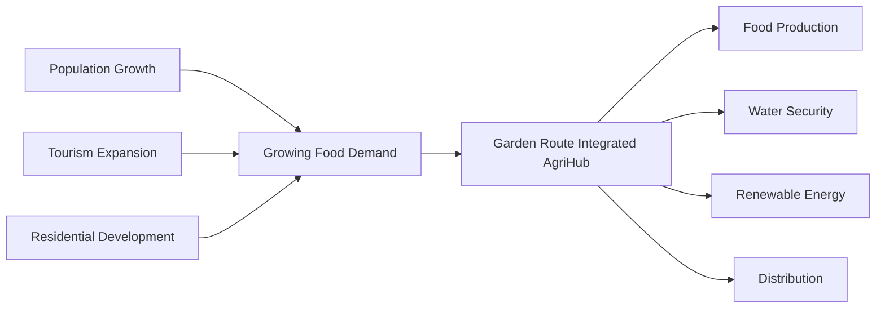
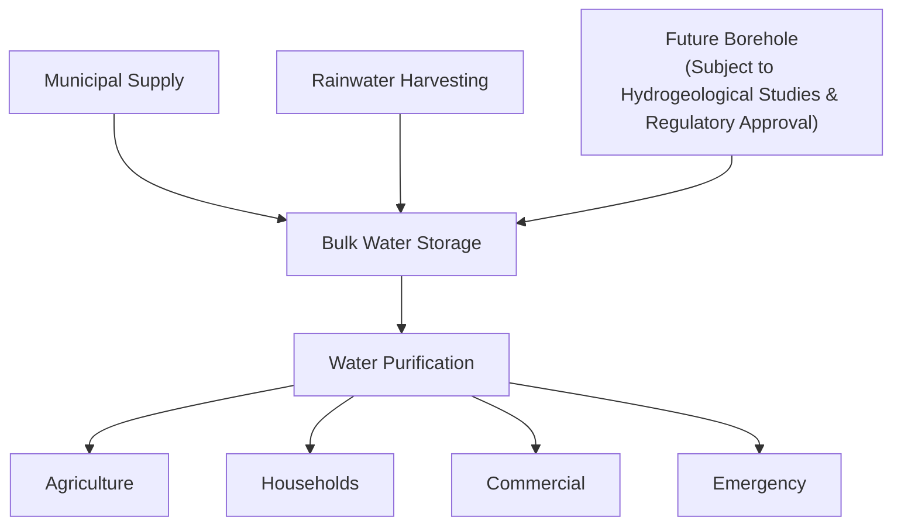
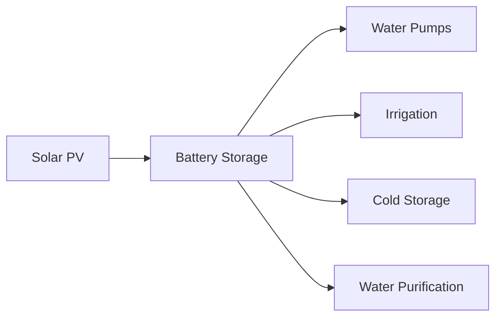
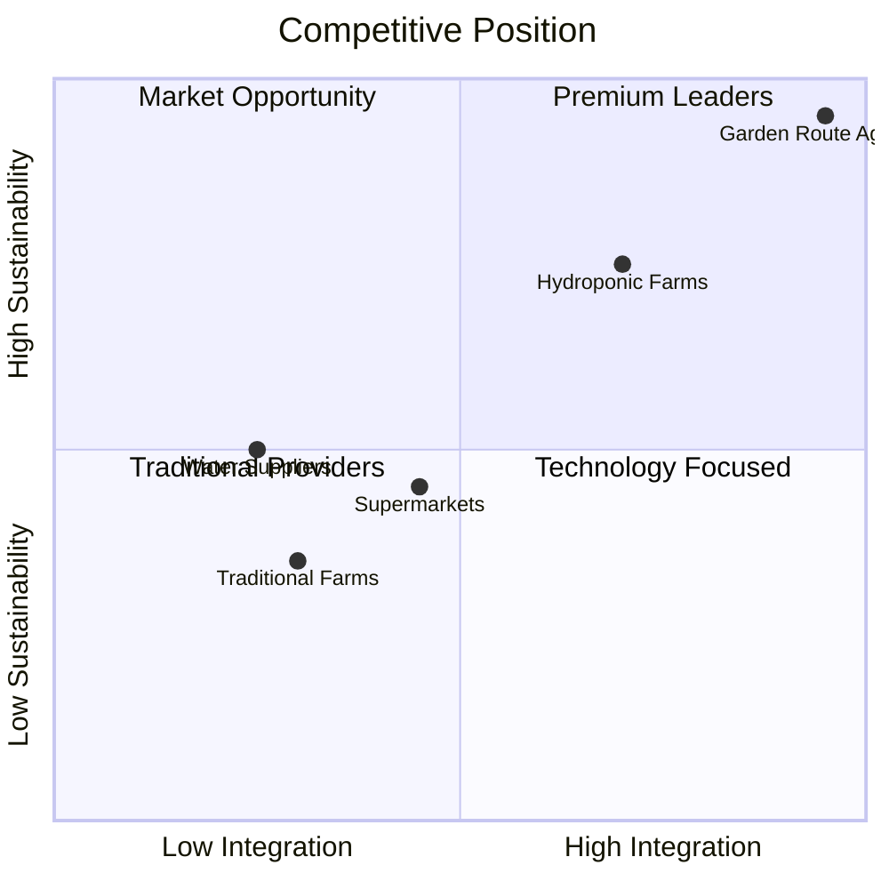
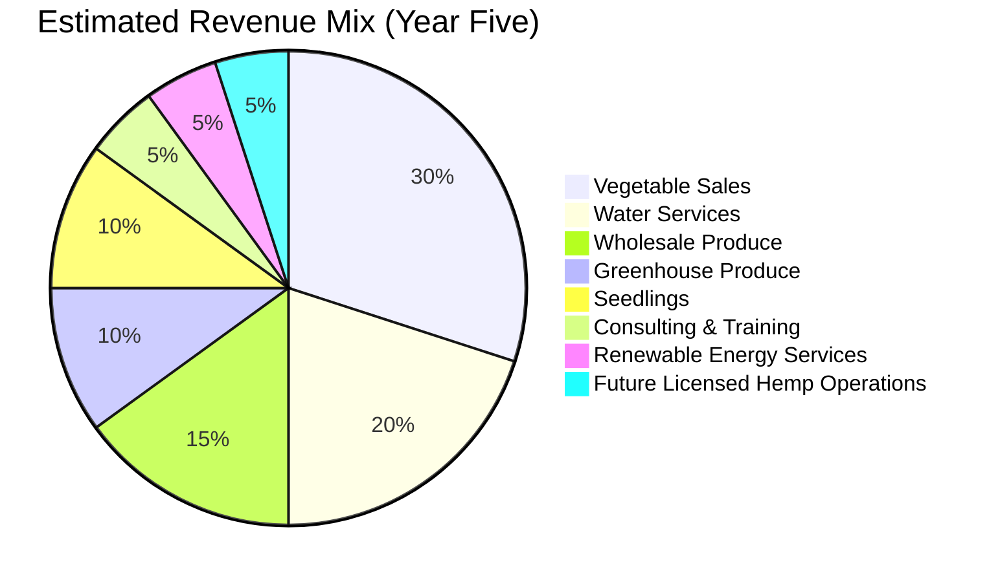
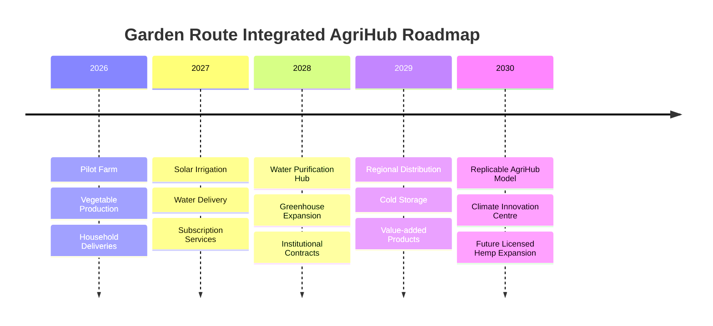

# 04 Market Research

> **Purpose**
>
> Comprehensive industry analysis, customer segmentation, competitor benchmarking, climate risk assessment, and commercial demand validation for the Garden Route Integrated AgriHub.

---

## Executive Summary

The Garden Route District represents one of South Africa's most attractive regions for climate-smart agricultural investment. Population growth driven by semigration, expanding tourism, increasing demand for premium fresh produce, and growing concerns around water and energy security create favourable conditions for an integrated agribusiness model.

Unlike traditional farming enterprises that rely on a single revenue stream, the **Garden Route Integrated AgriHub** is designed as a diversified ecosystem combining food production, water purification, renewable energy, and direct-to-community distribution. This integrated approach reduces operational risk while increasing commercial resilience and long-term profitability.

Global trends toward sustainable agriculture, food traceability, Environmental, Social and Governance (ESG) investing, and climate adaptation further strengthen the long-term viability of the project.

---

# Market Opportunity Snapshot

| Indicator | Current Trend | Strategic Opportunity |
|------------|---------------|----------------------|
| Population Growth | 📈 High | Growing household demand |
| Tourism | 📈 Strong | Hospitality & premium produce |
| Water Security | ⚠ High Risk | Water purification & storage |
| Renewable Energy | 📈 Accelerating | Solar-powered infrastructure |
| ESG Investment | 📈 Rapid Growth | Climate finance opportunities |
| Agriculture | 📈 Stable | High-value local food production |

---

# Macro Agricultural Landscape

South Africa's agricultural sector remains one of the country's strongest economic contributors, supporting employment, exports, rural development, and national food security.

However, producers face increasing structural challenges including:

- Climate variability
- Prolonged droughts
- Water scarcity
- Municipal infrastructure failures
- Rising electricity tariffs
- Fuel price volatility
- Increasing fertiliser costs
- Supply chain disruptions

These challenges are accelerating demand for integrated farming systems capable of producing food more efficiently while reducing dependence on vulnerable municipal infrastructure.

---

## Industry Outlook

The future of South African agriculture will increasingly be driven by:

- Climate-smart agriculture
- Precision farming
- Greenhouse production
- Renewable energy
- Digital agriculture
- Water-efficient irrigation
- Local food systems
- Circular economy practices

The Garden Route Integrated AgriHub has been designed around these long-term trends.

---

# Garden Route Regional Analysis

## Primary Service Area



---

## Regional Growth Drivers



---

## Demographic Trends

The Garden Route continues to experience sustained population growth driven by semigration from Gauteng, KwaZulu-Natal and the Cape metropolitan regions.

This growth increases demand for:

- Fresh vegetables
- Clean drinking water
- Local food production
- Sustainable farming
- Reliable logistics
- Renewable energy solutions

---

# Tourism Economy

The Garden Route remains one of South Africa's premier tourism destinations.

Primary commercial demand originates from:

- Hotels
- Restaurants
- Guesthouses
- Lodges
- Retirement estates
- Eco-estates
- Holiday accommodation

These customers require:

- Premium produce
- Consistent supply
- High food safety standards
- Reliable logistics
- ESG-aligned suppliers

---

# Water Security Assessment

## Existing Challenges

Commercial agriculture increasingly faces:

- Municipal water interruptions
- Seasonal droughts
- Population growth
- Ageing infrastructure
- Climate variability

---

## Integrated Water Strategy



---

# Renewable Energy Strategy

The integration of solar energy provides resilience against electricity supply interruptions while lowering long-term operating costs.

Applications include:

- Solar-powered irrigation
- Solar-powered pumps
- Water purification
- Cold storage
- Battery backup systems



---

# Consumer Trends

Consumer preferences continue shifting toward:

- Locally grown food
- Organic produce
- Sustainable farming
- Food traceability
- Reduced food miles
- Subscription delivery services

These trends favour integrated regional food systems capable of delivering freshness, quality and transparency.

---

# Customer Segmentation

| Customer Segment | Primary Need | Offering | Estimated Revenue |
|------------------|--------------|----------|------------------:|
| Households | Fresh food & clean water | Weekly subscriptions | 25% |
| Hospitality | Premium vegetables | Contract supply | 20% |
| Retailers | Local produce | Wholesale | 20% |
| Schools & Hospitals | Reliable food supply | Institutional contracts | 15% |
| Commercial Water | Bulk purified water | Water delivery | 15% |
| Consulting & Training | AgriTech & ESG | Advisory services | 5% |

---

# Customer Personas

## Household

Needs

- Affordable vegetables
- Weekly delivery
- Drinking water

Pain Points

- Grocery inflation
- Water interruptions

---

## Restaurant

Needs

- Reliable premium vegetables
- Fresh herbs

Pain Points

- Seasonal shortages
- Long supply chains

---

## Commercial Water Customer

Needs

- Emergency water supply
- Reliable delivery

Pain Points

- Municipal outages

---

# Competitive Landscape

| Competitor | Strength | Weakness | Our Advantage |
|------------|-----------|----------|---------------|
| Supermarkets | Scale | Long supply chains | Fresh local produce |
| Traditional Farms | Experience | Weather exposure | Integrated ecosystem |
| Water Suppliers | Existing customers | Single product | Food + Water + Energy |
| Hydroponic Farms | Technology | High electricity usage | Solar-powered resilience |

---

# Competitive Position



---

# SWOT Analysis

| Strengths | Weaknesses |
|------------|------------|
| Integrated business model | Capital intensive |
| Multiple revenue streams | New market entrant |
| Renewable energy integration | Scaling risk |

| Opportunities | Threats |
|---------------|---------|
| ESG investment | Climate volatility |
| Tourism growth | Inflation |
| Population growth | Input cost increases |
| Water scarcity | Competition |

---

# PESTLE Analysis

| Factor | Impact |
|---------|--------|
| Political | Food security initiatives |
| Economic | Inflation & input costs |
| Social | Healthy eating & local food |
| Technological | Solar & AgriTech adoption |
| Legal | Food safety & water regulations |
| Environmental | Climate adaptation |

---

# Porter's Five Forces

| Force | Risk Level | Assessment |
|--------|------------|------------|
| New Entrants | Medium | Moderate capital required |
| Supplier Power | Medium | Agricultural inputs concentrated |
| Buyer Power | Medium | Diversified customer base |
| Threat of Substitutes | Low | Essential products |
| Industry Rivalry | Medium | Strong differentiation possible |

---

# Projected Revenue Mix



---

# Risk Assessment

| Risk | Mitigation |
|------|------------|
| Drought | Rainwater harvesting, storage, greenhouse production |
| Municipal Water Failures | Water purification & bulk storage |
| Load Shedding | Solar PV and battery systems |
| Fuel Price Increases | Local distribution strategy |
| Climate Change | Climate-smart farming practices |
| Market Competition | Integrated ecosystem & premium quality |

---

# Strategic Business Flywheel


---

# Five-Year Growth Roadmap



---

# Strategic Conclusion

The Garden Route presents a compelling investment opportunity due to sustained population growth, expanding tourism, increasing food demand, water security challenges, and the transition toward renewable energy and climate-smart agriculture.

The Garden Route Integrated AgriHub differentiates itself through an integrated business model that combines food production, water infrastructure, renewable energy, and direct distribution into a single resilient ecosystem.

By diversifying revenue streams and reducing dependence on vulnerable infrastructure, the AgriHub is positioned to become a scalable, commercially sustainable enterprise capable of delivering measurable economic, environmental, and social impact across South Africa.

---

## References

- Statistics South Africa (Stats SA)
- Department of Agriculture, Land Reform and Rural Development (DALRRD)
- Western Cape Government
- Garden Route District Municipality Integrated Development Plan (IDP)
- Food and Agriculture Organization (FAO)
- World Bank
- International Fund for Agricultural Development (IFAD)
- Department of Water and Sanitation (DWS)
- South African Weather Service (SAWS)
```
