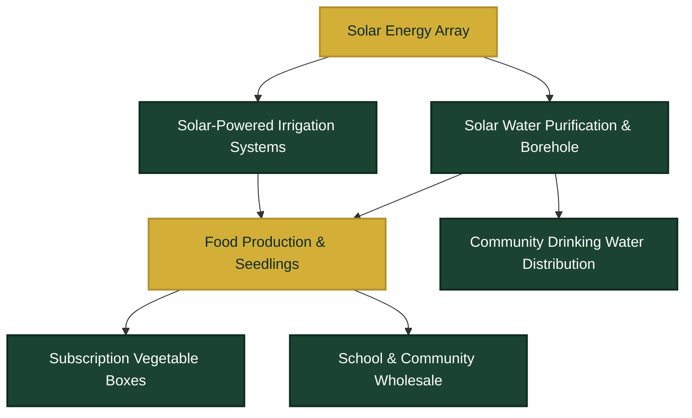

<div align="center">

# NACIRFA DREAM <p align="center">
  
</p>

<h1 align="center">NACIRFA DREAM GROUP (PTY) LTD</h1>
<p align="center"><b>Garden Route Integrated AgriHub</b></p>
The Garden Route Integrated AgriHub

[](LICENSE)
[](#)
[](#)
[](#)
[](CONTRIBUTING.md)

---

### *Building Climate-Resilient Communities Through Agriculture, Water, and Innovation*

</div>

<br/>

> **Executive Summary:** **NACIRFA DREAM** is the operating blueprint for the **Garden Route Integrated AgriHub** — a climate-smart agribusiness ecosystem that unites food production, water security, and solar energy under a single, closed-loop model. Built for South Africa's realities (food insecurity, water strain, load shedding, and youth unemployment), it serves as a replicable model for underserved regions across Southern Africa.

---

## Key Target Metrics (5-Year Horizon)

<div align="center">

| Food Target | Water Access | Job Creation | Subscription Base |
| :---: | :---: | :---: | :---: |
| **100+ Tonnes/Yr** | **Clean Drinking Supply** | **20–30 Direct Jobs** | **300+ Households** |

</div>

---

## Vision & Mission

* **Vision:** To become one of Southern Africa's leading integrated agricultural enterprises by combining sustainable food production, renewable energy, water security, and innovative farming systems — improving livelihoods, strengthening food security, and creating long-term economic opportunity.
* **Mission:** To develop scalable climate-smart farming systems that produce affordable, nutritious food, improve access to clean water, create employment, empower youth, and generate sustainable returns for investors — while protecting natural resources.

Full strategic breakdown: [`VISION_AND_MISSION.md`](VISION_AND_MISSION.md)

---

## The Problem We're Solving

| Challenge | Local Impact in South Africa | AgriHub Solution |
|---|---|---|
| **Food Insecurity** | Rising costs, limited access to fresh produce | Localized high-yield vegetable & seedling production |
| **Water Shortages** | Unreliable municipal supply, severe drought exposure | Borehole, rainwater harvesting & purification |
| **Load Shedding** | Disrupted irrigation & cold-chain reliability | 100% Off-grid solar-powered systems |
| **Youth Unemployment** | Limited entry points into skilled technical work | Hands-on training in AgriTech, solar, and water ops |
| **Climate Stress** | Unpredictable yields and volatile seasonal shifts | Climate-resilient farming & greenhouse integration |

---

## Integrated Ecosystem Architecture



---

## Repository Architecture

```
Garden-Route/
├── README.md
├── VISION_AND_MISSION.md
├── BUSINESS_MODEL.md
├── CONTRIBUTING.md
├── LICENSE
├── 04 Market Research/
│   └── README.md
├── 05 Financial Model/
│   └── README.md
├── 06 Funding Applications/
│   └── README.md
├── 07 Investor Pitch Deck/
│   └── README.md
├── 08 Branding/
│   └── README.md
├── 09 Website/
│   └── README.md
├── 10 Technical Documentation/
│   └── README.md
├── 11 SOPs/
│   └── README.md
├── 12 Images/
│   └── README.md
├── 13 Legal/
│   └── README.md
├── 14 ESG & Impact/
│   └── README.md
└── 15 Press Kit/
    └── README.md
```

| Folder | Purpose |
|---|---|
| [`04 Market Research`](04%20Market%20Research) | Industry analysis, target market data, competitor research, and demand studies |
| [`05 Financial Model`](05%20Financial%20Model) | Financial projections, revenue models, budget forecasts, and unit economics |
| [`06 Funding Applications`](06%20Funding%20Applications) | Grant applications, funding proposals, and loan documentation |
| [`07 Investor Pitch Deck`](07%20Investor%20Pitch%20Deck) | Investor presentations, one-pagers, and pitch materials |
| [`08 Branding`](08%20Branding) | Logo files, brand guidelines, and visual identity assets |
| [`09 Website`](09%20Website) | Website source files, content, and web assets |
| [`10 Technical Documentation`](10%20Technical%20Documentation) | System architecture and engineering specifications |
| [`11 SOPs`](11%20SOPs) | Standard operating procedures for farm, water, and distribution operations |
| [`12 Images`](12%20Images) | Photography, renders, and marketing imagery |
| [`13 Legal`](13%20Legal) | Contracts, compliance documents, and legal agreements |
| [`14 ESG & Impact`](14%20ESG%20&%20Impact) | Environmental, social, and governance reporting, plus impact measurement |
| [`15 Press Kit`](15%20Press%20Kit) | Media kit, press releases, and media-ready brand assets |
