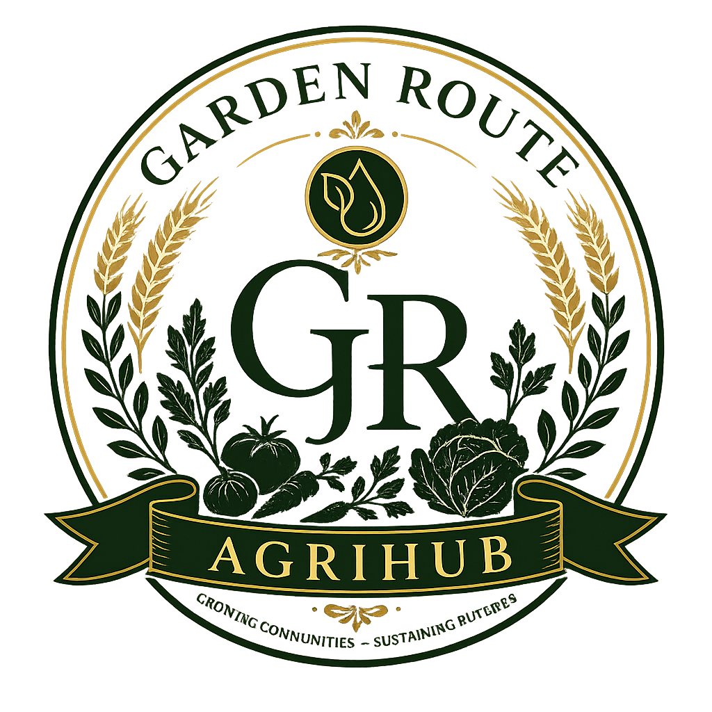
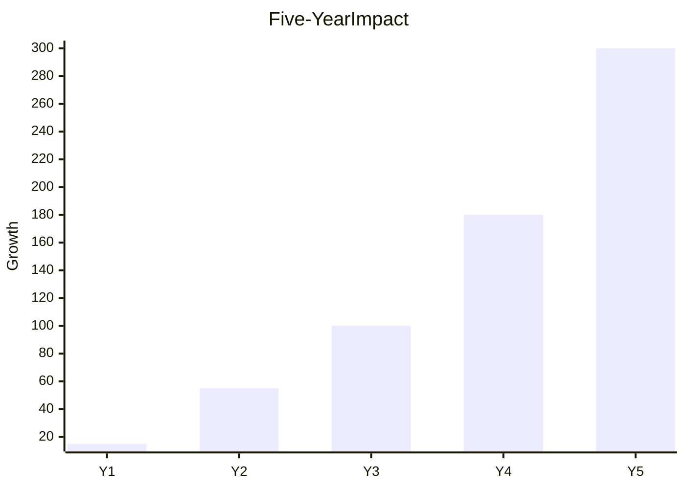
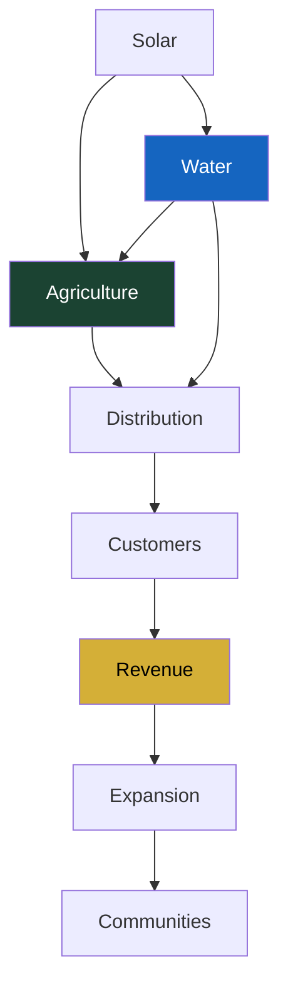
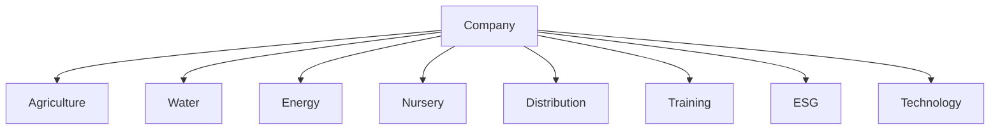
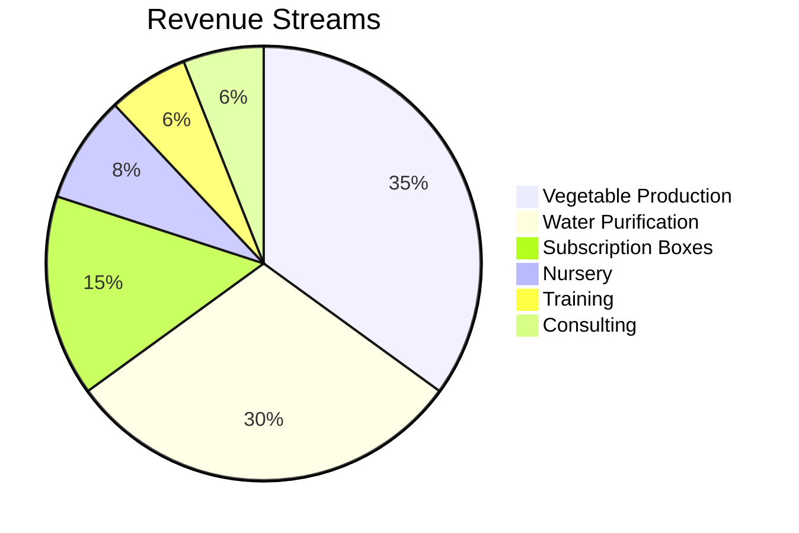
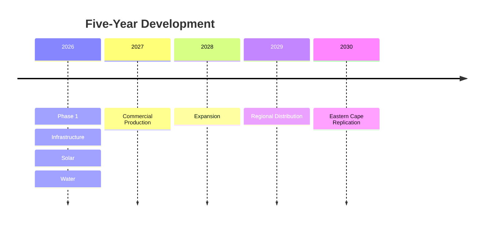
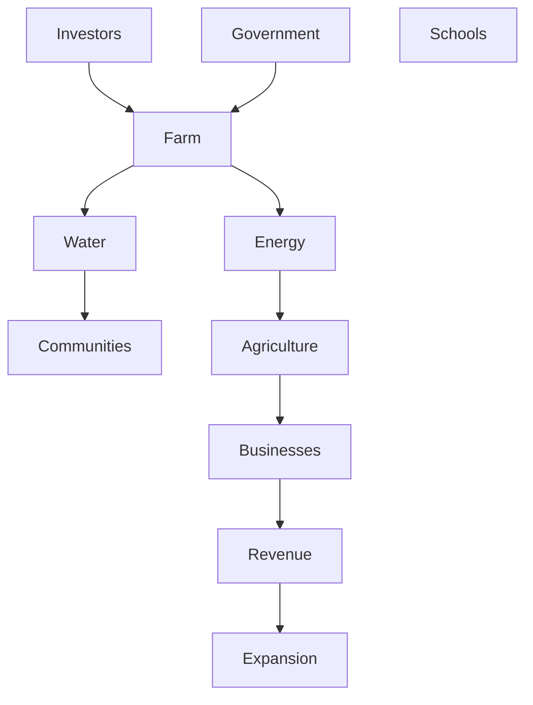
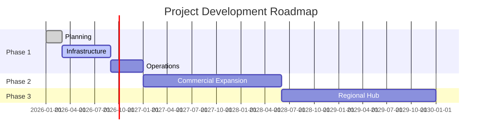

<div align="center">

<p align="center">
  
</p>

# Garden Route Integrated AgriHub

### Climate-Smart Agriculture • Water Security • Renewable Energy

[](LICENSE)
[](#)
[](#)
[](#)
[](#)

---

### Building Climate-Resilient Communities Through Agriculture, Water & Innovation

*A scalable agribusiness platform designed to improve food security, water resilience, renewable energy adoption and rural economic development throughout the Eastern Cape.*

</div>

---

# Executive Overview

The **Garden Route Integrated AgriHub** is the flagship project of **Nacirfa Dream Group (Pty) Ltd**.

The project combines:

- Commercial Agriculture
- Water Infrastructure
- Renewable Energy
- Agricultural Technology
- Community Development

into one integrated ecosystem capable of producing long-term commercial returns while delivering measurable environmental and social impact.

---

# Strategic Vision

```mermaid
mindmap

root((Garden Route))

Food Security

Water Security

Renewable Energy

Community Development

Employment

Agricultural Technology

Climate Resilience

Regional Expansion
```

---

# Project Dashboard

| KPI | Year 1 | Year 5 |
|:---|---:|---:|
| Vegetables Produced | 15 Tonnes | 100+ Tonnes |
| Clean Water Distributed | 100,000 L | 5,000,000 L |
| Solar Capacity | 5 kW | 75 kW |
| Jobs Created | 5 | 30 |
| Households Served | 30 | 300+ |

---

# Five-Year Growth



---

# The Challenge

South Africa faces multiple interconnected challenges.

| Challenge | Current Reality | Our Response |
|------------|----------------|--------------|
| Food Security | Rising food prices | Climate-smart farming |
| Water Scarcity | Municipal outages | Purification & storage |
| Load Shedding | Energy instability | Solar-powered operations |
| Youth Unemployment | Limited opportunities | Skills development |
| Climate Change | Drought & extreme weather | Protected agriculture |

---

# Integrated Business Model



---

# Business Divisions



---

# Revenue Diversification



---

# Capital Investment Roadmap



---

# Organisational Architecture



---

# Repository Documentation

| Documentation | Description |
|---------------|-------------|
| [Vision & Mission](VISION_AND_MISSION.md) | Corporate vision, mission and strategic objectives |
| [Business Model](BUSINESS_MODEL.md) | Integrated business ecosystem |
| [Market Research](04%20Market%20Research) | Industry analysis & market opportunity |
| [Financial Model](05%20Financial%20Model) | Five-year financial forecasts |
| [Funding Applications](06%20Funding%20Applications) | Grant & DFI submissions |
| [Investor Pitch Deck](07%20Investor%20Pitch%20Deck) | Institutional investment material |
| [Branding](08%20Branding) | Brand assets & identity |
| [Website](09%20Website) | Corporate website |
| [Technical Documentation](10%20Technical%20Documentation) | Infrastructure & engineering |
| [SOPs](11%20SOPs) | Operating procedures |
| [Legal](13%20Legal) | Governance & compliance |
| [ESG & Impact](14%20ESG%20&%20Impact) | Sustainability reporting |
| [Press Kit](15%20Press%20Kit) | Media resources |

---

# Documentation Progress

| Module | Status |
|---------|:------:|
| Vision & Mission | Complete |
| Business Model | Complete |
| Market Research | Complete |
| Financial Model | Complete |
| Funding Strategy | Complete |
| Branding | Complete |
| Website | In Progress |
| Technical Documentation | In Progress |
| SOPs | In Progress |
| ESG Framework | Planned |
| Investor Deck | Planned |

---

# Development Roadmap



---

# Impact Framework

```mermaid
flowchart LR

Investment

--> Infrastructure

--> Production

--> Revenue

--> Employment

--> Community

--> Regional Growth

style Community fill:#1B4332,color:#fff
style Revenue fill:#D4AF37,color:#000
```

---

# Project Statistics

| Metric | Value |
|----------|------:|
| Business Documents | 15+ |
| Financial Models | 20+ |
| Operating Procedures | 40+ |
| Revenue Streams | 6 |
| Investment Phases | 3 |
| Planned Infrastructure Assets | 50+ |
| Strategic Partners | Growing |

---

# Looking Ahead

The Garden Route Integrated AgriHub has been designed as a scalable platform for climate-smart agriculture, renewable energy, and water resilience. Through phased investment, disciplined execution, and measurable impact, the project seeks to establish a commercially sustainable agribusiness capable of replication throughout the Eastern Cape and Southern Africa.

---

<div align="center">

### Nacirfa Dream Group (Pty) Ltd

Building resilient agricultural ecosystems for future generations.

</div>
